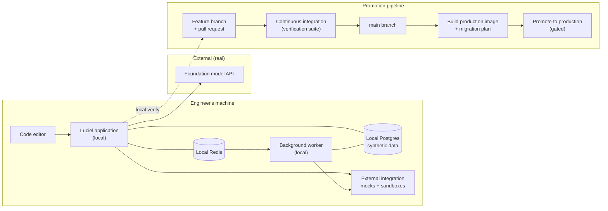
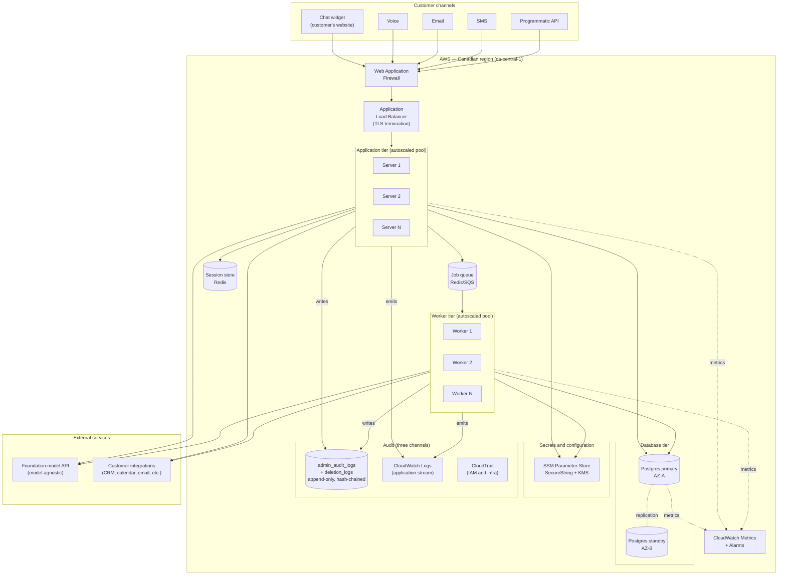
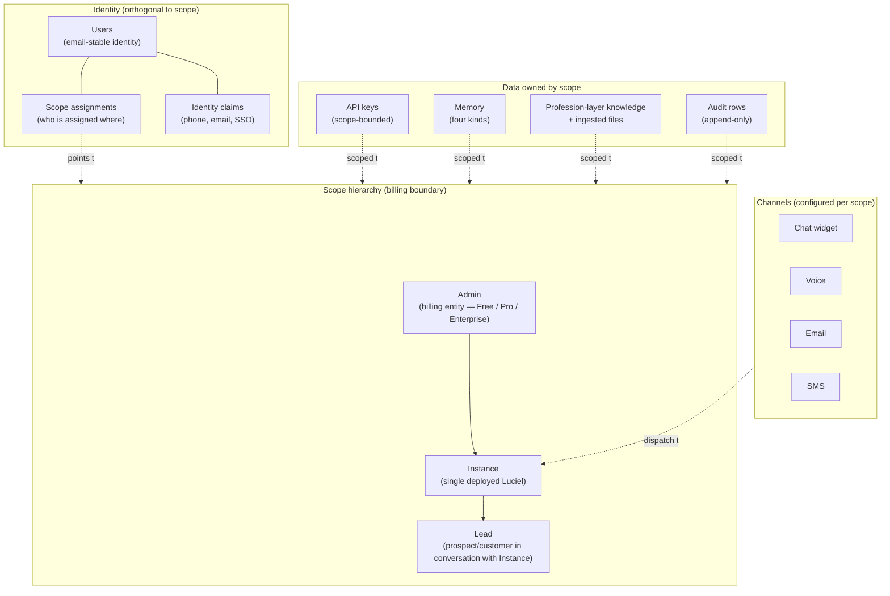

# Luciel — Architecture (Design)

**What this document is:** The design for how Luciel is built — both the development environment where we work, and the production environment where customers use it. Every architectural decision is anchored to a business reason from `CANONICAL_RECAP.md`.

**What this document is not:** A snapshot of what the repository currently contains. The repository is the implementation; this document is the design. Gaps between design and implementation are tracked as tokens in `DRIFTS.md`.

**Implementation markers used below.** Each substantive design claim that has a known implementation status carries one of:
- ✅ Implemented — repo (and prod where applicable) match the design
- 🔧 Partial — some of the design exists; specific gaps tracked as drifts in `DRIFTS.md`
- 📋 Planned — design committed; implementation tracked against a named roadmap step
- 🔬 Decision-gate — design says "we will choose later"; not a drift, an open product decision

Absence of a marker means the claim is design-level (architectural property, rationale) rather than a specific verifiable mechanism.

**Audience:** A senior engineer, a security reviewer, a thoughtful customer doing due diligence, or a future hire who needs to understand what we are building and why.

**Maintenance protocol:** Surgical edits only. When the design changes, update the relevant section in place and log the prior decision in `DRIFTS.md`. When the implementation catches up to a section, mark it implemented (per the marker scheme adopted in `DRIFTS.md` Phase 2). This document does not carry a top-of-file changelog: edits live in the section they touch, the closing entry for the drift that motivated the edit lives in `DRIFTS.md` §5, and the commit message records when and why.

---

## Section 1 — The two environments

Luciel runs in two environments. They are deliberately different, and the differences are part of the design.

**Development.** Where we build, break, and verify. No real customer data ever enters this environment. External integrations are mocked or replaced with sandboxes. The path from a working change in development to a deployed change in production is short, automatic in the parts that should be automatic, and gated at the points that need human judgment.

**Production.** Where customers use the product. Customer data lives only here. Every request is authenticated, scope-bounded, and audited. The environment is in a single Canadian region for data residency. It is designed to fail safe, recover automatically from common failures, and require a human only when something genuinely unexpected happens.

The rest of this document describes each environment, then the cross-cutting properties that span both.

---

## Section 2 — Development environment

### 2.1 What development is for

Development exists to do three things and only three things:

1. Let an engineer make a change to Luciel and see the effect immediately.
2. Run the verification suite that proves the change did not break any existing guarantee.
3. Produce a build artifact (a container image and a database migration plan) that can be promoted to production through a controlled path.

Development is **not** for testing with real customer data, demonstrating to customers, or running long-lived shared services. Anything that needs real-customer-equivalent conditions belongs in a separate staging environment (not yet built; see `DRIFTS.md` once Phase 2 begins).

### 2.2 The pieces

The development environment is a single engineer's machine plus a small set of services running locally or in tightly scoped sandboxes.

**Application server (local).** The same Luciel application that runs in production, running on the engineer's machine. Connects to a local database, a local task queue, and either a sandbox or a mocked version of every external integration.

**Database (local Postgres).** A local PostgreSQL instance with the same schema as production. Seeded with synthetic data — never with anything derived from a real customer. Migrations run against it on every change so schema drift cannot accumulate silently.

**Task queue (local Redis + worker).** A local Redis instance brokers background jobs to a locally-running worker process. The worker is the same code as the production worker, running with the same configuration shape — the only difference is which database and queue it points at.

**Foundation model access.** Calls to AI providers go to the real API in development, because mocking model behavior produces tests that pass against fiction. Cost and rate limits are handled by environment variables that an engineer can tighten on their own machine.

**External integrations.** Every external integration — calendar, CRM, email, SMS, voice, payments — is replaced in development by either a documented sandbox provided by the vendor (Stripe test mode, for example) or a local mock that records what would have been sent. No development call ever touches a real customer system.

**Secrets.** Development secrets are local-only, not derived from production, and never committed. The mechanism for loading them on an engineer's machine is the same mechanism production uses (a single secrets-loader function that reads from a configured source); only the source differs.

### 2.3 How a change moves from local to production

A change to Luciel passes through five stages, in order. The boundaries between stages are where we make sure the change is safe.

1. **Local change.** Engineer modifies the code. The application server reloads automatically. The engineer verifies the change behaves as intended.
2. **Local verification.** The verification suite runs on the engineer's machine. If it does not pass, the change does not move forward.
3. **Branch and pull request.** The change is pushed to a branch. The pull request is the gate where another engineer (or the founder) reviews it. The verification suite runs again, in continuous integration, against a clean checkout — to catch anything that depended on the engineer's local environment.
4. **Merge to main.** Once the pull request is approved and CI is green, the change merges to the `main` branch. Main is always deployable.
5. **Promotion to production.** A separate, deliberate step (not a merge side-effect) builds the production container image, runs migrations, and rolls the application servers and workers. Promotion is gated on a green production verification run.

The gates exist because the cost of a bad change increases exponentially after each one. A bug caught locally costs ten minutes; a bug caught in CI costs an hour; a bug caught in production after a customer noticed costs a day, a credit, and trust.

### 2.4 Development environment diagram

### 2.5 What development deliberately does not have

These are not gaps; they are decisions.

- **No real customer data.** Ever. Synthetic seeds only.
- **No real external sends.** Calendar invites, emails, SMS, payments — all sandboxed or mocked.
- **No production secrets.** Production secrets are unreachable from a developer machine.
- **No long-lived shared instance.** Each engineer runs their own. A future staging environment will fill the "shared, integration-tested, customer-equivalent" role.
- **No production data migration on local Postgres.** Migrations run forward against synthetic seeds; never copy production schema state down.

---

## Section 3 — Production environment

### 3.1 What production is for

Production exists to do four things:

1. Receive customer requests through any of the supported channels (chat widget, phone, email, SMS, and a programmatic API for integrators).
2. Authenticate every request, resolve which scope it belongs to, and reject anything that crosses a scope boundary.
3. Produce a Luciel response — composed of memory retrieval, tool invocation, foundation-model reasoning, and policy enforcement — and return it on the same channel.
4. Record every consequential action in the audit trail, atomically with the action itself, so the trail cannot diverge from reality.

Production is also responsible for keeping itself running — recovering from worker failures, scaling under load, and rotating secrets — without human intervention for the common cases.

### 3.2 The pieces

The production environment runs in **AWS, Canadian region (`ca-central-1`)**, deliberately. Customer data residency is a real differentiator for Canadian brokerages, and Canadian-region operation is a defensible answer in due diligence.

**Tenancy and tier shape (Arc 4 doctrine → Arc 5 Commit 2 Option A revision, current truth as of 2026-05-23).** The canonical tenancy model is `Admin → Instance → Lead` — three levels, uniform across every tier. The legacy four-level shape (`Tenant → Domain → Agent → Lead`) is retired; the Domain layer is removed entirely, `Tenant` is renamed `Admin`, `Agent` is renamed `Instance`. The tier surface over this uniform topology is three tiers: **Free / Pro / Enterprise**. **Free** is a $0 evaluation tier (1 Instance, **100 leads/month**, base model, no composition, **API enabled at 30 rpm with 1 embed key**, 1 admin-team seat; CAPTCHA-gated signup to bound abuse — see DRIFTS §3 `D-free-tier-captcha-missing-2026-05-22`, **escalated P2→P1** 2026-05-23 because Free API enablement widens the abuse surface from token-budget-only to programmatic-load-also). **Pro** is the paid solo-or-small-team tier (**10 Instances, 5,000 leads/month**, composition enabled within Admin at depth≤2, **API enabled at 300 rpm with 10 embed keys**, **25 admin-team dashboard seats** at admin-account scope (NOT per-Instance), 1 widget custom-domain CNAME via new `admin_widget_domains` table at Arc 6; flat-monthly Stripe billing; opens `D-pro-tier-rate-limit-abuse-surface-2026-05-23` for per-key + per-instance rate buckets landing at Arc 8 post-Arc-5). **Enterprise** is the unlimited-via-overrides tier with a **hybrid billing model** (platform fee + included usage + overage; committed-use discount available; metered through a new `billing_model` enum on `subscriptions` and a metering hook design at §3.2.14 below; runtime gap at DRIFTS §3 `D-enterprise-metering-not-implemented-2026-05-22`). Every subsection below that still names the pre-collapse nouns (`tenant_id`, `domain_id`, `agent_id`) reflects the unmigrated state of the code today; Arc 5 lands the `admin_id` / `instance_id` rename across the ~4,025 callsites, Arc 6 lands the Stripe SKU restructure (Free + Pro + Enterprise hybrid), and Arc 8 lands the security hardening that precedes both (CAPTCHA, worker-not-root, version/health endpoints, SES sandbox exit). The doc-level forward reference here applies to every numbered subsection: read the noun renames into the existing prose. Execution arc tracked at CANONICAL_RECAP §14 and DRIFTS §3 `D-tenancy-collapse-admin-instance-lead-2026-05-22`; business view at CANONICAL_RECAP §11.7 and §14; engineering source of truth for the entitlement matrix at arc4-out/A-tier-matrix-detail.md.

**Live today vs Designed but not built (subsystem status, current truth as of 2026-05-22-late).** Each subsection below ships at a defined readiness level. The table below is the canonical first-read view; legends: ✅ **Live today** = running in production at the head image; 🔧 **Live but unmigrated** = running in production today, but under the pre-collapse `tenant_id` / `domain_id` / `agent_id` noun set; will rename to `admin_id` / `instance_id` at Arc 5 (mechanical, no behavior change); 📋 **Designed but not built** = doctrine + design pinned, no production runtime; lands at the named Arc/Step.

| Subsection | Subsystem | Status | Lands at |
|---|---|---|---|
| §3.2.1 | Public endpoint (ALB + hostname) | ✅ Live today | — |
| §3.2.2 | Widget surface (CDN + embed keys) | 🔧 Live but unmigrated (chat leg only) | Voice/SMS/email at Step 34a |
| §3.2.3 | Application tier (FastAPI on ECS Fargate) | ✅ Live today | — |
| §3.2.4 | Background worker tier (Celery + Redis) | ✅ Live today (chat path); Council coordinator 📋 | Step 36 |
| §3.2.5 | Database (PostgreSQL on RDS, ca-central-1) | 🔧 Live but unmigrated | Arc 5 noun rename |
| §3.2.6 | Memory tier (vector + planned graph) | 🔧 Vector ✅; hybrid retrieval 📋 | Step 37 |
| §3.2.7 | Audit trail (`admin_audit_log`, immutable chain) | ✅ Live today | — |
| §3.2.8 | Secrets store (SSM Parameter Store, Pattern E) | ✅ Live today | — |
| §3.2.9 | Third-party integrations (Stripe, SES, OpenAI) | ✅ Live today (SES in sandbox) | SES production access at Arc 8 WU-6 |
| §3.2.10 | Monitoring and alerting (CloudWatch) | ✅ Live today | — |
| §3.2.11 | Identity & conversation continuity | 🔧 Single-Admin ✅; cross-Admin federation 📋 | Step 38 |
| §3.2.12 | Hierarchical dashboards & validation gate | 🔧 Live; tier-adaptive `/app` shell 📋 | Step 32 wave 2 |
| §3.2.13 | Billing surface (Stripe gateway) | 🔧 Live on legacy Individual/Team/Company SKU set | Free/Pro/Enterprise hybrid at Arc 6 |
| §3.2.14 | Metering hook + `billing_model` enum | 📋 Designed; no runtime | Arc 5 Revision A column add + Arc 6 hook wiring |

The `🔧 Live but unmigrated` rows are running customers' traffic today under the old noun set; the Arc 5 schema migration is a noun rename (column rename + FK rebind + ~4,025 callsite update across `app/` + `tests/`) with no behavior change at the request layer. The `📋 Designed but not built` rows have doctrine, drift carriers, and call-site target locations pinned but no production code; each lands at its named Arc/Step. Subsections below are written in present tense where the subsystem is ✅ Live today, and in design-spec tense ("lands", "will", "is designed to") where 📋. Where 🔧 applies, the prose reflects the current-truth runtime and the §3.2-header forward reference (above) carries the rename mapping.

#### 3.2.1 Public endpoint

**Triangulation:** Answers **Q7** (channels). Implements production baseline; full multi-channel surface lands at **Step 34a**. Integrity questions: DRIFTS §3 `D-channels-only-chat-implemented-2026-05-09`.

Customers reach Luciel through a single public hostname (the production API endpoint). The hostname is fronted by an Application Load Balancer. 📋 The full multi-channel surface lands in roadmap Step 34a; as of 2026-05-10 the chat widget (see §3.2.2 for its CDN tier and embed-key model), the programmatic API, and the operator-facing admin surface are the live channels, while voice / email / SMS adapters are still planned — see `DRIFTS.md` token `D-channels-only-chat-implemented-2026-05-09`.

*Why a load balancer:* it terminates TLS once, distributes incoming requests across multiple application servers (so a single server failure does not take the platform down), and provides a single chokepoint where request rate-limits and a Web Application Firewall can be applied. The chokepoint also gives the operator a single place to flip traffic during a deployment or roll back from one.

*Why not API Gateway:* an ALB is the right tool for steady-state, long-lived, multi-channel traffic with WebSocket and streaming response support. API Gateway is well-suited to bursty, request-response, function-style workloads, which Luciel is not.

#### 3.2.2 Public widget surface (CDN + embed keys)

**Triangulation:** Answers **Q7** (channels — the widget leg). Implements **Step 30b** (CDN + bundle), **Step 30d** (issuance-time scope-prompt preflight, content-safety gate), **Step 31.2** (optional `luciel_instance_id` pin on embed-key issuance — lifts the v1 carve-out that pinned every key to its tenant default instance). Closing tags: `step-30b-widget-cdn-complete`, `step-30d-content-safety-complete`, `step-31-2-cookie-bridge-and-instance-embed-keys-complete`. Integrity questions: DRIFTS §3 `D-widget-no-content-safety-or-scope-guardrail-2026-05-10` (CLOSED §5), `D-widget-chat-no-application-level-audit-log-2026-05-10` (CLOSED §5), `D-route-shipped-without-end-to-end-coverage-2026-05-10` (widget-surface slice CLOSED, broader-routes slice OPEN).

The chat widget is a public surface: the JavaScript bundle that customers paste into their site is served by a content delivery network, and every chat turn it makes to the production API is authenticated by a key designed for public distribution. Both pieces are distinct from the rest of §3.2 — they sit at the edge alongside §3.2.1, before any request reaches the application tier — and warrant naming.

**Widget bundle CDN.** The widget bundle (`widget.js`, currently ~27 KB) is published to a CloudFront distribution backed by an S3 bucket in the same Canadian region as the rest of production. Two URLs serve the same body: a stable alias (`/widget.js`, `max-age=300, must-revalidate`) for customers who want auto-updates on a five-minute lag, and an immutable hashed alias (`/luciel-chat-widget.<hash>.js`, `max-age=31536000, immutable`) for customers who want to pin a specific version. Both URLs stay reachable forever — the deploy pipeline is forward-only, never overwriting an existing hashed bundle.

*Why CDN, not direct from the application tier:* customers' sites embed the bundle on every page load; serving it from the application tier would put every page-load request on the same path as chat turns and tax the wrong scaling axis. A CDN serves the static bundle at the edge, near the visitor, with no application-tier (§3.2.3) involvement.

*Why a Canadian-region origin:* data residency. The bundle has no PII in it, but the residency story is cleaner when every Luciel-controlled production resource sits in `ca-central-1`. The CDN itself is global, as it must be — a Toronto visitor and a Vancouver visitor should both get fast bundle loads — but the origin is Canadian.

*Pattern E for bundles:* the deploy pipeline is forward-only. A new bundle build produces a new hashed filename; the old hashed filename is never deleted. A customer that pinned `luciel-chat-widget.36a25740a60c.js` two months ago still gets that exact bundle today. The stable alias `widget.js` is updated to point at the new bundle, but the old bundle stays reachable for any pinned consumer. This is the bundle analogue of §4.6 (Pattern E for secrets): deactivation by replacement, never deletion.

**Public-surface keys (embed keys).** Embed keys are a distinct kind of API key from the admin keys operators use to manage tenants and domains. The differences are deliberate:

- An embed key is scoped to a single domain and a small set of allowed origins (exact scheme + host + optional port, no wildcards or paths). A POST from any other origin is refused at the auth layer regardless of what the key permits.
- An embed key carries a `widget_config` (accent color, display name, greeting message) that the widget bundle reads to brand the chat surface per customer. This is the only place where customer-facing presentation is encoded outside the customer's own site.
- An embed key carries a per-key rate limit (today static, designed to be tunable per customer once Step 31 dashboards expose it).
- An embed key has the chat permission and only the chat permission — it cannot call admin endpoints, cannot mint other keys, cannot invoke tools. The three-layer scope enforcement described in §4.7 applies the same way it does to any other key.
- An embed key is **safe to ship in public source code** on the customer's site, because origin enforcement plus permission constraint plus rate limit plus domain scoping bound the worst case to "a malicious actor on an allowed origin can run a chat session at the published rate limit." That is a customer-tolerable failure mode; an admin key in the same position is not.

*Why embed keys exist as a separate kind:* the trust model is different. Admin keys are operator secrets and rotate per operator. Embed keys are customer-shipped credentials and rotate per customer-side incident (e.g., a customer accidentally publishes their key to the wrong repo). Conflating them would either over-protect admin keys with widget concerns or under-protect customer surfaces with admin assumptions.

*Pattern E for embed keys:* deactivation, never deletion. A rotated embed key remains in the `api_keys` table with `is_active=false`; the audit chain (§3.2.7) stays walkable. The customer pastes a new key into their site and the old one stops authenticating on the next request.

*Issuance:* `POST /admin/embed-keys` (with three scope guards and an audit row written in the same transaction as the key insert) or the operator CLI `scripts/mint_embed_key.py`. Both paths funnel through the same `EmbedKeyCreate` schema and the same service entrypoint, so they cannot drift on validation or audit behavior. The raw key value is returned exactly once at mint time and is never recoverable; SSM (§3.2.8) is rejected for embed keys at the service layer because the customer cannot read SSM. At issuance time, a scope-prompt preflight (see `app/services/scope_prompt_preflight.py`) verifies that domain-scoped mints target a `domain_configs` row with a non-empty `system_prompt_additions`; tenant-wide mints skip the preflight (governed by `TenantConfig.system_prompt` at chat time) and surface a non-fatal warning on the response.

*Instance pinning (Step 31.2, 2026-05-13):* `EmbedKeyCreate` accepts an optional `luciel_instance_id: int | None` (gt=0, default=None). When present, `app/api/v1/admin.py` resolves the instance through `LucielInstanceRepository.get_by_pk` and applies four guards before delegating to `ApiKeyService.create_key`: the instance exists (404 if not), its `tenant_id` matches the caller's scope (403 if not), its `domain_id` matches the embed key's `domain_id` (403 if not), and the instance is active (422 if `is_active=false` per Pattern E §4.6). The persisted `api_keys.luciel_instance_id` FK column was already present on the model before Step 31.2 — the schema is unchanged — and the chat path in `app/api/v1/chat_widget.py` (line 183 `request.state.luciel_instance_id`, line 417 propagation) was already wired to consume it. Step 31.2 only carved the issuance side, lifting the prior v1 restriction that defaulted every minted key to the tenant's default instance. Operationally this is what makes Sarah's Deploy sub-tab in the admin dashboard (Step 32) able to mint a key bound to the specific Luciel instance she opened, rather than pinning every embed key to the tenant default; the widget chat path then routes the visitor's turn to the correct instance without any further plumbing.

#### 3.2.3 Application tier

**Triangulation:** Honours Recap **Section 4** (the never-do contract executes here) and **§4.7** (three-layer scope enforcement). Implements production baseline (Steps 1–10).

A pool of application servers runs the request-handling Luciel code. Each server is identical, stateless across requests, and replaceable. Scaling is horizontal — adding capacity means adding more servers, not making any one server larger.

*Why stateless:* statelessness is what makes recovery and scaling trivial. Any conversation state that needs to persist across requests lives in the database or in a session store, not in server memory. A server can die mid-request and the next request from the same conversation routes to a healthy server with no loss.

*Why a pool, not a single server:* survivability. Single-server architectures fail visibly to the customer when the one server fails. A pool absorbs the failure of any one member.

*Autoscaling:* application-tier capacity scales on observed load (request rate, CPU, response latency). The minimum is sized to absorb a single-server failure without customer impact; the maximum is sized to absorb any plausible burst the GTM plan would produce.

#### 3.2.4 Background worker tier

**Triangulation:** Answers **Q4** (coordinator surface lands here). Implements production baseline; coordinator at **Step 36**, scheduled retention purge worker shipped at **Step 30a.2**. Integrity questions: DRIFTS §3 `D-celery-task-surface-thin-2026-05-09`, `D-celery-worker-runs-as-root-2026-05-11`, `D-celery-beat-single-replica-coupling-2026-05-14`; closed: `~~D-retention-purge-worker-missing-2026-05-09~~` (DRIFTS §5, closed at Step 30a.2).

A separate pool of worker processes handles work that should not block a customer's chat response. Per-responsibility status:
- ✅ Memory extraction (the worker task that reads recent turns and persists durable memories)
- 🔧 Document ingestion — implemented today as foreground code in `app/knowledge/ingestion.py`, not as a worker task; promotion to background is roadmap Step 34
- ✅ Scheduled retention purge — shipped at Step 30a.2 (2026-05-14). `app/worker/tasks/retention.py::run_retention_purge` walks `tenants.deactivated_at < now() - INTERVAL '90 days'` and hard-deletes leaf-first through the cascade-complete soft-delete graph (`messages` → `identity_claims` → `conversations` → `sessions` → other leaves → tenant). Scheduled via `app/worker/celery_app.py` `beat_schedule = {'retention-purge-nightly': crontab(hour=8, minute=0)}` at 08:00 UTC nightly. AdminAuditLog survives the purge per the audit-chain integrity contract in §3.4. Worker container embeds Celery beat via the `--beat` flag in `Dockerfile.worker` — single-replica coupling tracked at `D-celery-beat-single-replica-coupling-2026-05-14` as known future-debt.
- 📋 Search-index refresh, follow-up emails, and other workflow-action background work — roadmap Step 34

Workers receive jobs from a queue and report results back through the database.

*Why a separate tier:* a worker doing a 30-second document ingestion should never delay a customer's three-second chat response. Putting workers on their own pool isolates the two workloads from each other.

*Why a queue, not direct invocation:* the queue is what makes worker failures invisible to the customer. If a worker dies mid-job, the queue redelivers the job to another worker. The customer's interaction was already complete when the job was enqueued; the worker is doing its work behind the scenes.

*Production broker:* **Amazon SQS** (not Redis) in production. Redis is the development broker only. The split is documented in detail in `app/worker/celery_app.py` (lines 116-138) and exists because ElastiCache Redis in cluster mode cannot satisfy kombu's MULTI/EXEC requirements (ClusterCrossSlot constraint), and SQS is the right primitive for durable, multi-AZ job delivery in AWS. The architecture diagram in Section 3.6 shows "Job queue Redis/SQS" — read that as Redis-in-dev / SQS-in-prod, not as a choice.

*Worker autoscaling:* worker-tier capacity scales on queue depth and CPU. Quiet hours run a small fixed pool; busy hours scale up to absorb the backlog and scale back down once it clears. The Step 30a.2 embedded-beat shape constrains the autoscaling minimum to 1 replica until `D-celery-beat-single-replica-coupling-2026-05-14` closes — raising the floor before that closure activates the duplicate-tick failure mode on every scheduled task. The retention task is idempotent (cursor + leaf-first delete order absorb duplicate ticks safely), but future scheduled tasks added at Step 34 may not be.

#### 3.2.5 Database — PostgreSQL on Amazon RDS, Canadian region

**Triangulation:** Foundation row store for **Q1, Q2, Q7** (all scope rows + identity claims + conversations live here; Q1 absorbs the prior Q6 rotation-and-departure leg under CANONICAL_RECAP §11 WU-9.1 renumbering; cross-channel renumbered from old Q8 to current Q7). Implements production baseline (Steps 1–10); identity tables added at **Step 24.5c**, dashboard read paths at **Step 31**.

A single managed PostgreSQL instance (with a hot standby in a second availability zone) holds the durable state of the platform.

*Why Postgres:* mature, audited, and supports the relational integrity our scope hierarchy depends on. Every Luciel, memory, key, and audit row has a foreign key to its scope, and the database enforces it — so a bug in our application code cannot accidentally hand one scope another scope's data, regardless of which scope level (tenant, domain, agent, or instance) is involved.

*Why managed RDS rather than self-hosted:* operational maturity. Backups, point-in-time recovery, version upgrades, and standby failover are all handled by AWS. The cost of self-hosting Postgres at this stage is engineering time we do not have to spare.

*Why a single instance, not a per-tenant instance:* cost and operational simplicity. Per-tenant isolation at the row level (with hard-enforced scope foreign keys) gives us the isolation properties we need without paying for a separate database per customer. The dedicated-infrastructure tier (Section 13 of the canonical recap) provides a per-tenant database for customers whose compliance posture requires it; that is a deliberately separate product.

*Two database roles, not one.* The application server connects as a privileged role that can write any table, including identity tables. Background workers connect as a least-privilege role that can read most tables and write some, but **cannot** write to identity tables, audit tables, or anything that mints or rotates keys. This is enforced at the database grant level, not in application code.

*Why two roles:* a worker bug, or a worker compromise, must not be usable to mint or rotate keys. The database refuses the write, regardless of what the worker code says. Defense in depth.

#### 3.2.6 Memory tier

**Triangulation:** Answers **Q3** (hybrid retrieval decision lives here). Implements production baseline (vector half); document ingestion at **Step 32a**; hybrid retrieval decision-gate at **Step 37**. Cross-session retrieval (the Q7 cross-channel-continuity leg, renumbered from old Q8 under CANONICAL_RECAP §11 WU-9.1) added at **Step 24.5c** — see §3.2.11. Integrity questions: DRIFTS §3 `D-context-assembler-thin-2026-05-09`.

Memory is layered (per the canonical recap). The four kinds — session, user preference, domain, client operational — live as distinct logical concerns over the database, with retrieval driven by a memory service.

*Session memory* lives in a fast key-value store (Redis) for the active conversation, with a short time-to-live; persistent state for that conversation is also written to Postgres so a Redis flush does not lose conversation history.

*User preference memory*, *domain memory*, and *client operational memory* all live in Postgres, with vector embeddings for semantic retrieval and (per the strategic answer to Q3) an opt-in graph layer for relationship-walking queries — implemented first as recursive Postgres queries, with a path to a dedicated graph database when scale demands it.

*Why layered, not flat:* different kinds of memory have different retention rules, different scoping rules, and different retrieval patterns. Flat memory cannot enforce that user preferences should expire or be exportable on request, while operational rules should not. Layering is what makes the policies enforceable.

#### 3.2.7 Audit trail

**Triangulation:** Honours Recap **Section 4** (the contract proves itself through audit rows) and answers **Q6** (audit log shows what happened, when, by whom). Implements production baseline; widget application log stream added at **Step 31 sub-branch 1**. Closing tag: `step-31-dashboards-validation-gate-complete`. Integrity questions: DRIFTS §3 `D-pillar-4c-evidence-location-recap-ambiguous-2026-05-13`, `D-pillar-4d-audit-row-field-verify-deferred-2026-05-13`, `D-pillar-4e-cross-table-row-verify-deferred-2026-05-13`.

Every consequential action in production produces an immutable audit record. There are three independent channels, designed so a tampering attempt is detectable.

- **Database audit log.** A append-only table (`admin_audit_logs`) that records every control-plane and data-plane control event (key minting, scope changes, deactivations, deletions, configuration changes). Each row is hash-chained to its predecessor — modifying any historical row breaks the chain and is detectable on the next verification run.
- **Application log stream.** A separate stream (CloudWatch Logs) where the application emits the same audit events in human-readable form. Independent of the database. Useful for forensic investigation, incident response, and regulator-facing exports. ✅ For the customer-facing widget chat surface, `app/api/v1/chat_widget.py` emits three structured `logger.info` lines per turn — `widget_chat_turn_received` at entry, `widget_chat_session_resolved` after lazy session creation, `widget_chat_turn_completed` after the stream finishes — each carrying the documented field set (`tenant_id`, `domain_id`, `embed_key_prefix`, `session_id`, plus per-event provenance and timing), none carrying raw message body. Landed in Step 31 sub-branch 1 (PR #30); closed `D-widget-chat-no-application-level-audit-log-2026-05-10`. The broader application-log claim across non-widget customer-reachable routes stays scoped to the broader-routes slice of `D-route-shipped-without-end-to-end-coverage-2026-05-10`, which remains OPEN beyond Step 31 — closing the broader slice requires extending the validation-gate harness with a `pull_request` trigger on the same allowlist shape as the widget-e2e harness (a Pattern E follow-up that did NOT land at Step 31). **§3.2.7 redaction-and-field-set contract on `admin_audit_log` rows (post-hoc note added 2026-05-13):** The audit chain emits to two distinct paths — the three `logger.info` markers above (operational telemetry in `/ecs/luciel-backend`, no field-set contract attached) AND structured rows to the `admin_audit_log` DATABASE TABLE written by the `before_flush` SQLAlchemy listener registered in `app/repositories/audit_chain.py` via `install_audit_chain_event()` in `app/main.py` and `app/db/session.py`. The field-set redaction contract this subsection commits to (`tenant_id`, `domain_id`, `embed_key_prefix`, `session_id` populated; no raw message body; `_CHAIN_FIELDS` row-hash chain advances on every commit) attaches to the **DB rows**, not the CloudWatch markers. Production-row verification of this contract against the synthetic-turn rows from 2026-05-12 18:17–18:21 EDT is deferred-but-tracked at DRIFTS §3 `D-pillar-4d-audit-row-field-verify-deferred-2026-05-13` (field-set verify) and `D-pillar-4e-cross-table-row-verify-deferred-2026-05-13` (cross-table identity-claim/conversation/session/message linkage verify). Both naturally pick up after Step 32 (rotation runbook) lands so the read uses a freshly-rotated admin DSN. The recap-summary phrasing that conflated CloudWatch markers with audit-row emission is tracked at DRIFTS §3 `D-pillar-4c-evidence-location-recap-ambiguous-2026-05-13`.
- **AWS CloudTrail.** AWS's own immutable record of every IAM and infrastructure action — who logged in, who minted what, what was deployed when. We do not write to CloudTrail; AWS does, and we read it.

A retention purge produces records in a fourth append-only table (`deletion_logs`) so retention events are distinguishable from control-plane events but follow the same immutability discipline.

*Why three channels:* an attacker who compromises the application can write false rows to the database log, but cannot retroactively rewrite the application log stream or CloudTrail. A regulator asking "show me what happened" gets three independent answers; if they disagree, that disagreement is itself the signal.

#### 3.2.8 Secrets store

**Triangulation:** Pattern E (§4.6) lives here. Operational prerequisite for **Q6** (rotation on role change). Implements production baseline; rotation runbook lands at **Step 32a** (re-targeted from Step 32 on 2026-05-13 when Step 32's scope locked to admin dashboard UI; tracked at `D-rotation-procedure-laptop-dependent-2026-05-12`). Integrity questions: DRIFTS §3 `D-secret-disclosure-recurrence-2026-05-12`, `D-rotation-procedure-laptop-dependent-2026-05-12`.

Every secret used in production — database credentials, foundation-model API keys, third-party integration credentials, signing keys — lives in AWS Systems Manager Parameter Store as a SecureString, encrypted with a customer-managed KMS key.

*Why Parameter Store, not environment variables baked into images:* secrets in container images leak. Image layers are inspectable. A compromised image registry exposes every secret used by every image. Parameter Store decouples secrets from images — the image fetches the secret at startup, and rotating the secret means updating Parameter Store, not rebuilding and redeploying.

*Why SSM, not Secrets Manager:* both work; we picked Parameter Store for cost predictability and because the audit story (CloudTrail records every read) is identical.

*Pattern E:* secrets are deactivated, never deleted. A rotated secret remains in Parameter Store with a deactivated flag, so an audit query can reconstruct what credential was active at any past moment. This is part of the broader audit-chain discipline (see Section 4). 🔬 The exact SSM-side mechanism for the deactivated flag (suffix-renamed parameter vs. SSM version history) is pending operator confirmation — see `DRIFTS.md` token `D-prod-secrets-pattern-e-unverified-2026-05-09`.

**Arc 3 hardening 2026-05-22 — JWT kid-rolling envelope + admin-password rotation + SES IAM posture.** Two paired-prod-touch ceremonies and one ledger-correction landed in the Arc 3 backend-hygiene + auth-hardening pass; all three live under this subsection's secrets-store doctrine and are recorded here so the architecture mirrors the shipped backend (`luciel-backend-service` running task `c3ce028a76642ef852b1774043ef878`, image `sha256:b4c145eb3f...arc3-prod-ops`).

- **JWT kid-rolling envelope (Work-Unit B.2).** The HS256 JWT signing key now lives in SSM under the structured key `/luciel/production/jwt_signing_keys_json` (SecureString, currently at v2). The parameter holds a JSON object with two fields: `active_kid` (the string identifier of the key in use for new mints) and `keys[]` (an array of `{kid, secret, status}` objects where `status ∈ {primary, grace, retired}`). Today the active kid is `v2026-05-21` (primary) and the previous standalone secret has been demoted to `legacy` (grace, accepted on inbound verification only). Every mint path in `app/services/magic_link_service.py` — the four `mint_*_token` helpers covering magic-link login, set-password, invite-acceptance, and password-reset — stamps the `kid` header on every issued JWT, and the shared `_decode()` helper selects the verification key by the inbound token's `kid` header (falling back to `active_kid` if the header is missing, preserving back-compat for any in-flight pre-cutover token). A key rotation is therefore: mint a new key under a fresh kid, write it to the SSM JSON with `status='primary'`, demote the previous primary to `status='grace'`, retire any grace-window-expired key by flipping it to `status='retired'`, and let any in-flight tokens minted under the prior kid verify cleanly through the grace window. The cutover ceremony for `v2026-05-21` ran 2026-05-21 evening (see `arc3-out/B2-6-cutover-record.md`); the unit-test pinning lives at `tests/services/test_magic_link_kid_rolling.py` (9 cases, all green). This envelope replaces the prior single-secret-at-`MAGIC_LINK_SECRET` shape (the legacy parameter at `/luciel/production/magic_link_secret` is preserved Pattern E and feeds the `legacy` kid during the grace window).
- **`luciel_admin` master-user password rotation (Work-Unit B.1).** The RDS master-user password on `luciel-db.c3oyiegi01hr.ca-central-1.rds.amazonaws.com` was rotated on 2026-05-22 EDT after operator scrollback exposure during the B.2.* arc churn. The new 64-char password was generated locally, `aws rds modify-db-instance --master-user-password file://...` applied it to the RDS instance, the connection string at SSM `/luciel/database-url` was updated via `put-parameter --type SecureString --overwrite --value file://...` (now at v3, sha256 `D667F2BAC066F104B7CFEDB6C6E44370A8B4C187DF2901833813C405A6DE070C`), the round-trip was sha256-verified via `get-parameter`, and `luciel-backend-service` was force-deployed to pick up the new secret (task `c3ce028a76642ef852b1774043ef878` now runs healthy on the rotated password). The four local secret files used during the ceremony were zero-overwritten and deleted (Phase 10 of the rotation runbook) so no plaintext remains on the operator's disk. The worker service runs as `luciel_worker` (separate user, separate password, untouched by this rotation per Step 28 D-1 schema doctrine). The scoped `luciel_app` DB role that retires the backend's use of the master user is tracked as Arc 8 follow-up `D-backend-runs-as-rds-master-user-2026-05-21` — the rotation is the interim hardening that closes the scrollback-exposure leak loudly.
- **SES IAM posture — ledger correction (Work-Unit B.3).** The `LucielSESSendEmail` inline policy on `luciel-ecs-web-role` was discovered to be already in place pre-Arc-3, scoped to `arn:aws:ses:ca-central-1:729005488042:identity/vantagemind.ai` with `ses:SendEmail`, `ses:SendRawEmail`, `ses:SendBulkEmail`. The originating drift `D-luciel-ecs-web-role-missing-ses-send-permission-2026-05-18` (closed 2026-05-22 in `DRIFTS.md` §5) was raised on a partial scout; the IAM layer is sound for the current sandboxed-SES posture. Two paired Arc 8 follow-ups carry the remaining work: `D-ses-iam-overgrant-unused-actions-2026-05-22` (drop unused `ses:SendBulkEmail` action and widen `Resource` to `identity/*` at sandbox exit) and `D-ses-sandbox-exit-pending-2026-05-22` (the umbrella deliverability drift, ticket text drafted at `arc3-out/B4-ses-sandbox-exit-request.md`, operator submits via AWS Console). SES sandbox state for `ca-central-1` is `ProductionAccess=false` today; verified identities receive, unverified addresses fail with `AccessDeniedException`. The full deliverability runway (feedback-loop SNS topic, application-layer suppression list, monitored reply-to inbox) is tracked as Arc 8 sub-arc with three sibling §3 drifts: `D-ses-feedback-loop-not-wired-2026-05-22`, `D-ses-suppression-app-layer-not-implemented-2026-05-22`, `D-ses-reply-to-monitored-inbox-not-confirmed-2026-05-22`.
- **Arc 8 WU-6 Phase A+B — SES deliverability topology landed 2026-05-22 (code + AWS infra, prod deploy pending).** Phase A code at commit `c3d974f` (origin/main) introduces the application-layer half of the deliverability runway: two Alembic migrations chained off `b4d8a2e7c1f3` — `a91c4d2e7f08` (`email_send_event` cursor table tracking provider message-id, event type, recipient hash, timestamp; deduplication anchor for the SNS-fed feedback loop) and `b2e5f17a3d9c` (`email_suppression` table holding hard-bounce + complaint suppressed addresses, application-layer enforced at every send path through the email service). Settings `ses_configuration_set_name="luciel-default"` and `ses_reply_to_address="support@vantagemind.ai"` are now first-class config; every outbound `SendEmail`/`SendRawEmail` call stamps the configuration set so SES emits engagement events into the feedback channel. Test surface: 47/47 WU-6 + 94/94 email-related green. Phase B AWS infrastructure landed the same day: SNS topic `arn:aws:sns:ca-central-1:729005488042:luciel-ses-events` (the feedback-loop sink), SES configuration set `luciel-default` with `SendingEnabled=true` and `ReputationMetricsEnabled=true`, event destination `luciel-feedback-to-sns` subscribing the topic to `BOUNCE`/`COMPLAINT`/`REJECT`/`RENDERING_FAILURE`, and an IAM rightshape on inline policy `LucielSESSendEmail` (role `luciel-ecs-web-role`): action set collapsed to `[ses:SendEmail, ses:SendRawEmail]` (dropped `ses:SendBulkEmail`), resource widened to `arn:aws:ses:ca-central-1:729005488042:identity/*` under a single Sid `AllowSESSendUnderLucielConfigSet`. The pre-rightshape policy is preserved at operator-local `iam-backup-LucielSESSendEmail-pre-arc8-wu6.json` (716 bytes). Sandbox-exit request submitted as AWS Support case `177948223100786` (2026-05-22 16:37 EDT, Severity low, 24–72h SLA). DRIFTS status: `D-ses-iam-overgrant-unused-actions-2026-05-22` RESOLVED; `D-ses-feedback-loop-not-wired-2026-05-22` PARTIALLY-RESOLVED (SNS + config set live, route subscription deferred to Phase C); `D-ses-suppression-app-layer-not-implemented-2026-05-22` CODE-COMPLETE-AWAITING-DEPLOY; `D-ses-reply-to-monitored-inbox-not-confirmed-2026-05-22` CODE-COMPLETE-AWAITING-DEPLOY-AND-MAILBOX-CONFIRM; `D-ses-sandbox-exit-pending-2026-05-22` SUBMITTED-AWAITING-AWS. Phase C (still owed before full closure): run the two Alembic migrations on prod RDS, build + push backend image #82, force-deploy ECS to image #82 and verify `/version`, author + deploy `app/api/v1/ses_events.py` route, subscribe the route URL to the `luciel-ses-events` SNS topic, run an E2E synthetic bounce test. Execution-record stanza at `arc8-out/A-arc8-security-hardening-arc-record.md` §3.6.X carries the full Phase A+B audit detail.
- **Arc 8 WU-6 Phase C — SES feedback-loop end-to-end LIVE in prod 2026-05-22 ~22:30 EDT.** Phase C closed the operational leg of the deliverability runway authored at Phase A+B. Backend image #82 (digest `sha256:ef7f8fe1c3a721d88ecd2f72d18770bd857efbb39cc92f1723b292ee930b6da3`) deployed via task-def `luciel-backend:83` (env-binding revision after `:82` image-only) carrying the `app/api/v1/ses_events.py` route (SNS `SubscriptionConfirmation` auto-confirm + `Notification` event-write with two-check trust gate against `settings.ses_sns_topic_arn`); worker `luciel-worker:37` redeployed against the same image digest for symmetry. Both Alembic migrations (`a91c4d2e7f08` → `b2e5f17a3d9c`) applied to prod RDS via ECS-exec `alembic upgrade head`. SNS HTTPS subscription `arn:aws:sns:ca-central-1:729005488042:luciel-ses-events:f15b16e1-24ed-484a-9772-ba8fd5fcdb90` auto-confirmed in ~1s on first subscribe. SSM `/luciel/production/SES_SNS_TOPIC_ARN` populated and bound to the task def as env var `SES_SNS_TOPIC_ARN` (NOT prefixed `LUCIEL_` per Pydantic Settings `app/core/config.py` field-name discovery: `ses_sns_topic_arn: str = ""` with `model_config = SettingsConfigDict(env_file=".env", extra="ignore")`, no `env_prefix` set). **Mid-deploy IAM patch:** the inline `LucielSESSendEmail` policy on `luciel-ecs-web-role` was extended atomically via `aws iam put-role-policy` from Resource `[identity/*]` to Resource `[identity/*, configuration-set/luciel-default]` when the first synthetic-bounce send surfaced `AccessDeniedException` on the configuration-set resource (Phase B's rightshape was a partial scout that did not enumerate the configuration-set authorization surface; the gap was invisible pre-WU-6 because pre-WU-6 code did not pass `ConfigurationSetName`). This is captured as net-new drift `~~D-ses-iam-config-set-resource-missing-2026-05-22~~` (resolved-in-same-arc). **E2E synthetic-bounce verification:** send to `bounce@simulator.amazonses.com` returned MessageId `010d019e523ba0d7-e46f9a4d-e609-4df7-9133-d61e310ce2fa-000000`; `email_send_event` row `id=1 event_type=Bounce event_id=e3a2c23f-9c8a-5bdb-aade-a0b56a6eeeaa` landed in prod RDS; `email_suppression` row `id=1 address=bounce@simulator.amazonses.com reason=HardBounce source_event_id=e3a2c23f-9c8a-5bdb-aade-a0b56a6eeeaa` landed with the audit chain intact (`suppression.source_event_id` exactly matches `event.event_id`, FK constraint enforced). **DRIFTS post-Phase-C state:** `~~D-ses-feedback-loop-not-wired-2026-05-22~~` RESOLVED, `~~D-ses-suppression-app-layer-not-implemented-2026-05-22~~` RESOLVED, `~~D-ses-iam-config-set-resource-missing-2026-05-22~~` RESOLVED (net-new + closed-in-arc); `D-ses-reply-to-monitored-inbox-not-confirmed-2026-05-22` CODE-DEPLOYED-AWAITING-MAILBOX-CONFIRM (code leg live; operator mailbox confirmation owes — Cloudflare Email Routing path: `support@vantagemind.ai` → operator inbox); `D-ses-sandbox-exit-pending-2026-05-22` SUBMITTED-AWAITING-AWS (case `177948223100786`, no change). **Four new Phase-D-hardening drifts logged** during the Phase C deploy (all OPEN, batched for Arc 8 WU-9): `D-version-endpoint-auth-gated-2026-05-22`, `D-task-def-no-healthcheck-2026-05-22`, `D-ssm-naming-mixed-prefixes-2026-05-22`, `D-ecs-exec-role-overbroad-ssm-2026-05-22`. Full execution record at `arc8-out/A-arc8-security-hardening-arc-record.md` §3.6.X (Phase C stanza).

The full Arc 3 closing-tag chain is `arc-3-backend-hygiene-auth-hardening-ses-posture-doc-truthing`; the per-work-unit closure records live in `arc3-out/` (B1, B2.5, B2.6 cutover, B2 kid-rolling design memo, B3 ledger correction, B4 ticket text, Work-Unit C tier-provisioning gate). The doc-truthing pass that mirrors this Arc into the canonical docs (`docs/DRIFTS.md` and this subsection) is Arc 7 pulled forward and shares the same closing tag.

#### 3.2.9 What integrations exist today

**Triangulation:** Answers **Q7** (the channel-adapter framework's v1 surface) and **Q5** (the billing surface that turns the scope hierarchy into a revenue surface). Implements production baseline; channel-adapter framework at **Step 34a**; workflow tools (CRM, calendar, email send) at **Step 34**; the Stripe billing integration at **Step 30a** (closing tag `step-30a-subscription-billing-complete`) with the surface architecture in §3.2.13. Integrity questions: DRIFTS §3 `D-channels-only-chat-implemented-2026-05-09`, `D-external-integrations-llm-only-2026-05-09`, ~~`D-billing-team-company-not-self-serve-2026-05-13`~~ (RESOLVED at Step 30a.1), `D-magic-link-auth-cookie-session-2026-05-13`.

The design anticipates a full slate of external integrations — calendar, CRM, email, SMS, voice, payments — with a sandbox-in-development / real-in-production split per integration. Today, the integrations layer (`app/integrations/`) contains the foundation-model clients (Anthropic and OpenAI) **and the Stripe client** (`app/integrations/stripe/`, API v2024-06-20, CAD-only at v1, Stripe Tax enabled) shipped with Step 30a; the architectural surface that consumes it is documented at §3.2.13. The tool registry shape (`app/tools/registry.py`, `app/tools/broker.py`) is in place; the channel integrations themselves are not. 📋 The full slate beyond Stripe is roadmap Step 34 (Workflow actions); the channel surface specifically is roadmap Step 34a. Tracked as `DRIFTS.md` token `D-external-integrations-llm-only-2026-05-09`.

This subsection exists so the doc stops implying the full slate is present. The framework is ready; the integrations — Stripe excepted — are not.

#### 3.2.10 Monitoring and alerting

**Triangulation:** Operational prerequisite for every live answer (Q1–Q7; renumbered from Q1–Q8 under CANONICAL_RECAP §11 WU-9.1); the proof surface that says "the platform is still healthy". Implements **Step 28** (alarm foundation); first observed live during **Step 30c** rollout. Integrity questions: DRIFTS §3 `D-prod-alarms-deployed-unverified-2026-05-09`.

Production emits four kinds of signal:

- **Metrics:** request rate, error rate, latency percentiles, worker queue depth, database connection saturation, foundation-model token usage. CloudWatch Metrics.
- **Logs:** the application log stream described above, plus access logs from the load balancer.
- **Traces:** for slow or failed requests, a trace records which database calls, model calls, and tool calls were made and how long each took. Used for debugging slow conversations.
- **Alarms:** thresholds on metrics that, when crossed, page the operator. Examples: error rate above 1% sustained for five minutes, queue depth above 1000 for ten minutes, database connection saturation above 80%.

*Why all four:* metrics tell us *that* something is wrong; logs and traces tell us *what* is wrong; alarms tell us *when* to act. Removing any of the four leaves a gap.

#### 3.2.11 Identity & conversation continuity

**Triangulation:** Answers **Q7** (cross-channel continuity; renumbered from old Q8 under CANONICAL_RECAP §11 WU-9.1). Implements **Step 24.5c**. Closing tag: `step-24-5c-cross-channel-identity-complete`. End-user-driven claim verification deferred to **Step 34a**; cross-tenant identity federation deferred to **Step 38**. Integrity questions: DRIFTS §3 `D-step-24-5c-and-31-schema-and-code-undeployed-to-prod-2026-05-12`.

A prospect who chats with Luciel on a customer's website on Monday and calls the customer's Luciel-answered phone line on Wednesday should not have to re-introduce themselves. Continuity across channels is a product commitment (Recap §11 Q7, §13.1 T8 — Q7 renumbered from old Q8 under WU-9.1; T-scenario label T8 preserved), and the architecture answers it with three primitives that compose without breaking any existing scope or audit guarantee. ✅ Implemented in the Step 24.5c implementation arc on 2026-05-11 across five sub-branch PRs (#24 models + Alembic migration `3dbbc70d0105`; #25 `app/memory/cross_session_retriever.py`; #26 `app/identity/resolver.py`; #27 `SessionService.create_session_with_identity()` adapter hook; #28 live e2e + this doc-truthing commit). Closing tag: `step-24-5c-cross-channel-identity-complete`, cut on this doc-truthing commit per the Step 30c `99c6eb5` precedent. v1 success criterion demonstrated end-to-end against the live shipped code in `tests/e2e/step_24_5c_live_e2e.py` (real Postgres, real ORM, real resolver + service + retriever — six claim groups covering channel-cross identity recognition, cross-session retrieval, and scope-boundary rejection); backend-free harness-shape pin in `tests/api/test_step24_5c_live_e2e_shape.py`. The voice/SMS/email legs inherit the same three primitives and become reachable end-to-end when Step 34a's channel adapter framework lands.

**`conversations` table — the durable thread.** A new table holds one row per cross-channel conversation: `id` (UUID, primary key), `tenant_id`, `domain_id`, `created_at`, `last_activity_at`, `active`. Scope-bearing per §4.1 (every row has a foreign key to its scope; the three-layer enforcement in §4.7 applies the same way as it does to every other scope-bearing row). One conversation never spans tenants or domains — a conversation is the *grouping concept* within a scope, not above it.

**`sessions.conversation_id` — the session-linking FK.** `sessions` gains a nullable `conversation_id` foreign key pointing at `conversations.id`. Nullable is deliberate: a session that arrives with no continuity claim (a brand-new visitor on a fresh device with no prior identity_claim match) stays as a single-session conversation until and unless a future session links into it. The session row itself remains the atomic auditable unit — message rows still hang off `sessions.id`, the existing `messages.session_id` FK is unchanged, and the audit chain at the session granularity stays walkable. This is **session-linking, not session-merging**, by design (see §4.9 rejected-alternative bullet).

**`identity_claims` table — channel-equivalent identifiers, orthogonal to scope.** A separate table records the channel-specific identifiers that resolve back to a `users.id`: `id`, `user_id` (FK to `users.id`), `claim_type` ∈ {`email`, `phone`, `sso_subject`}, `claim_value` (case-folded for `email`, E.164-normalised for `phone`, opaque for `sso_subject`), `issuing_scope_id` (the scope that asserted the claim), `issuing_adapter` (which ingress adapter asserted it — `widget`, `programmatic_api`, and later `voice_gateway`, `sms_gateway`, `email_gateway`), `verified_at` (nullable; populated only when end-user-driven verification lands at Step 34a / Step 31), `active`, `created_at`. Uniqueness is enforced on (`claim_type`, normalised `claim_value`, `issuing_scope_id`) so two scopes can independently assert the same phone number or email without colliding (a number that belongs to Brokerage A's prospect and Brokerage B's prospect are two different facts, both true).

Claims are orthogonal to scope the same way `users` are: a `User` can have many `identity_claims`, possibly under different scopes, and a `User` is never tenant-scoped. Cross-scope identity reads are platform-admin only — enforced at the service layer, same as cross-tenant `User` reads today (`app/models/user.py` docstring). Per the strategic answer to Q7 (Recap §11; renumbered from old Q8 under WU-9.1), in v1 a claim is **asserted by the ingress adapter** that consumes the channel and trusted within its issuing scope: the phone gateway swears the call came from a particular E.164 number; the widget swears the embed-key request came from a particular logged-in `User` (when the customer's site has authenticated the visitor); the programmatic API caller swears the message belongs to a particular email it knows out-of-band. **End-user-driven verification** (email-confirm link, SMS one-time code, SSO subject match) is a separate, additive capability tracked against Step 34a + Step 31; v1 records the claim as asserted, with `verified_at=NULL`, and the conversation-continuity logic treats asserted-but-unverified claims as sufficient for retrieval within the issuing scope. Cross-scope continuity is explicitly out of scope at v1 (Step 38 territory — §4.9 rejected-alternative below).

**`CrossSessionRetriever` — the runtime surface.** A new retriever in `app/memory/` (sibling to the existing per-session retriever) answers "given the active session's `(conversation_id, tenant_id, domain_id)`, what are the N most recent messages from sibling sessions under the same conversation, ordered by recency, capped by a per-call budget?" The retriever takes the same shape as every other memory retriever in §3.2.6 — it returns ranked passages with provenance metadata (`source_session_id`, `source_channel`, `timestamp`) that the runtime layer threads into the foundation-model context as the cross-session leg of memory retrieval. Scope filtering happens **inside the retriever**, not at the caller: the retriever refuses to return a row whose `tenant_id` / `domain_id` does not match the calling scope, even if the same `conversation_id` is shared across scopes (which it cannot be, by the conversations-table FK, but the retriever asserts it anyway — defense in depth, same discipline as §4.7).

**How a request resolves continuity.** At the start of a request (§3.3 step 4, scope policy check), after the requesting key resolves to its `(tenant, domain, agent)` scope, the runtime asks the identity resolver: "is there a `User` whose `identity_claims` include the channel-specific identifier this adapter just asserted, within this scope?" If yes, the session is bound to that `User` and a `conversation_id` is resolved by walking the `User`'s other recent active sessions under the same scope (the most recent active conversation wins; configurable per scope). If no, a brand-new `User` (synthetic, per §4 of `app/models/user.py`) and a brand-new `conversation_id` are minted in the same transaction. The session row is then created with the resolved (or newly-minted) `conversation_id`. Identity resolution is one query; conversation resolution is one query; the cost is bounded.

**What stays unchanged.** The auth surface (embed-key resolution, programmatic-API key resolution) is untouched. The three-layer scope enforcement in §4.7 is untouched — if anything, the cross-session retriever adds a *fourth* check at the memory retrieval boundary. The message audit chain is untouched — messages still belong to sessions, sessions still belong to scopes, and `conversation_id` is a sibling concept that groups sessions without re-parenting messages. The four-kinds-of-memory contract (§3.2.6) is untouched — cross-session retrieval is a sibling of session memory, scoped the same way, not a fifth kind.

**What this design deliberately does not solve in v1** (carried forward, not regressions):
- End-user-driven claim verification (email-confirm link, SMS code, SSO assertion). Adapter-asserted is the v1 trust model; verification is added when the adapters that consume it exist (Step 34a + Step 31).
- Cross-tenant identity federation (a `User` recognised across Brokerage A and Brokerage B as the same person). §4.9 rejected-alternative below — Step 38 territory by design.
- A per-`User` inbox view spanning all channels (Step 31 dashboards).
- Voice / SMS / email channel adapters (Step 34a). The primitives in this subsection are framework-ready for them; the adapters themselves are not.

#### 3.2.12 Hierarchical dashboards & validation gate

**Triangulation:** Answers **Q2** (three-tier dashboards) and completes pre-launch posture for **Q1 / Q7** via the five-pillar gate (Q1 absorbs the prior Q6 rotation-and-departure leg under CANONICAL_RECAP §11 WU-9.1; cross-channel renumbered from old Q8 to current Q7). Implements **Step 31**. Closing tag: `step-31-dashboards-validation-gate-complete`. Dashboard frontend UI deferred to **Step 32**. Integrity questions: DRIFTS §3 `D-step-24-5c-and-31-schema-and-code-undeployed-to-prod-2026-05-12`, `D-pillar-4c-evidence-location-recap-ambiguous-2026-05-13`, `D-pillar-4d-audit-row-field-verify-deferred-2026-05-13`, `D-pillar-4e-cross-table-row-verify-deferred-2026-05-13`.

Every scope-level operator — a company owner, a department lead, an individual professional — needs to answer "is Luciel earning its keep here?" in under a minute, scoped to exactly what they're allowed to see. And no new customer goes live until five categories of readiness are all green. These are sibling commitments: the dashboards are how a live customer reads value out of Luciel; the validation gate is how an operator proves a customer is ready to be live in the first place. ✅ Implemented across Step 31's five sub-branches (PRs #29 design-lock, #30 widget audit log + `create_session_with_identity` route wiring, #31 `DashboardService`, #32 dashboard HTTP surface, #33 five-pillar validation gate harness, #34 this doc-truthing commit); closing tag `step-31-dashboards-validation-gate-complete` annotated on this doc-truthing commit per the Step 30c `99c6eb5` / Step 24.5c `55e4db9` precedent. The harness exits 0 against live Postgres on 2026-05-12 (run stamp `20260512-144847-068362`, 40/40 claims green across all five pillars); backend-free harness-shape pin in `tests/api/test_step31_validation_gate_shape.py` (19 contract tests) guards it in the existing AST CI lane.

**Tenancy and tier shape (Arc 4 doctrine, current truth).** Under the Admin → Instance → Lead model and the Free / Pro / Enterprise tier surface, the dashboard hierarchy is **Admin rollup / Instance-group view / Single-instance view**, with the tier deciding which views are reachable rather than the data shape doing so. **Free** renders only the Single-instance view (one Instance, no rollup pane — there is nothing to roll up). **Pro** renders the Admin rollup + Instance-group view (composition surface visible at the depth-2 bound). **Enterprise** renders all three views plus the metering / overage surfaces driven by the `billing_model` enum on `subscriptions` (see §3.2.14 below). The three-method dashboard-service shape is preserved at the FK layer; method signatures rename from `tenant_id`/`domain_id`/`agent_id` to `admin_id`/`instance_group_id`/`instance_id` at Arc 5. Role-based filtering selects scope: an `owner` sees the Admin rollup; an `instance_lead` sees the Instance-group pane for their assigned Instances; a `member` sees only their assigned Single-instance detail. The `/app` shell selector maps tier→view directly (Free→1 view, Pro→2 views, Enterprise→3 views + metering pane). Execution arc tracked at CANONICAL_RECAP §11 Q2 and DRIFTS §3 `D-tenancy-collapse-admin-instance-lead-2026-05-22` + `D-enterprise-metering-not-implemented-2026-05-22`.

**Three scope-bound dashboard views.** `app/services/dashboard_service.py` exposes three methods, one per level of the hierarchy in §4.1:
- `get_tenant_dashboard(tenant_id)` — returns aggregates over every domain and every agent under the tenant, plus a top-N list of the busiest domains and the most-active Luciel instances.
- `get_domain_dashboard(tenant_id, domain_id)` — returns aggregates over every agent under the domain, plus a top-N list of the busiest agents.
- `get_agent_dashboard(tenant_id, domain_id, agent_id)` — returns aggregates over every Luciel instance under the agent.

Every method respects the three-layer scope enforcement from §4.7: the caller's resolved scope is the **upper bound** of what the method can read, not a hint. A tenant-admin key cannot reach into another tenant; a domain-admin key cannot reach upward to its tenant or sideways to a sibling domain; an agent-admin key cannot reach to other agents under the same domain. Defense-in-depth applies the same way the cross-session retriever in §3.2.11 applies it: the SQL WHERE filters by the caller's scope; a post-query loop re-asserts the scope on each materialised row and drops (with ERROR log) any row that ever slipped through.

**Aggregates surfaced (v1):** turn count, unique-user count, escalation count, moderation-block count, latency p50/p95, top-N most-active Luciel instances, top-N busiest domains/agents (only at the level above), seven-day trend lines. All aggregates read from existing tables — `traces` (already populated per-turn by `app/services/trace_service.py`), the scope tables (`tenants`, `domains`, `agents`, `luciel_instances`), and the identity tables from §3.2.11. No new DB writes. The widget-chat application-log emissions added in Step 31 sub-branch 1 give the same data a second, log-shaped read path for forensic and regulator use, independent of the DB read path the dashboard service uses.

**HTTP surface.** `GET /api/v1/dashboard/tenant`, `GET /api/v1/dashboard/domain/{domain_id}`, `GET /api/v1/dashboard/agent/{agent_id}` under `app/api/v1/dashboard.py`, each calling the corresponding service method through the existing `ScopePolicy` chain. The endpoints require an admin or scope-admin key — embed keys cannot reach any of the three (the `EMBED_REQUIRED_PERMISSIONS` set explicitly excludes dashboard reads, the same way it excludes tool calls). Response shape is a stable JSON envelope so a future frontend (Step 32) renders against it without breaking when fields are added. UI lives at Step 32; the v1 success criterion of "under a minute" is met by the API surface plus a thin operator-facing renderer, not by a full frontend.

**Pre-launch validation gate.** Before any new customer is allowed to go live, an operator runs `tests/e2e/step_31_validation_gate.py` against the customer's seeded scope (a runnable script in the Step 30c / Step 24.5c precedent shape — not pytest, exits 0 on all-claims-pass, exits 1 on any-claim-fail, exits 2 on env-not-set-up, Postgres required). Five pillars, all five must be green:
- **Isolation.** Two tenants seeded with overlapping shapes; every dashboard call from one, and every cross-session retriever call from one, cannot see the other's data. This is the same §4.7 promise made concrete on real data.
- **Customer journey.** A widget turn through `SessionService.create_session_with_identity()` lands an `identity_claims` row, a `conversations` row, a `sessions` row, message rows, a trace row, and — with the audit emission from sub-branch 1 — the three structured log lines (`widget_chat_turn_received`, `widget_chat_session_resolved`, `widget_chat_turn_completed`). The dashboard for that scope reflects the turn within the same run.
- **Memory quality.** The memory-extraction worker runs against the seeded turn; the resulting memory item is scope-bound and recoverable on the next session under the same `conversation_id`. Cross-session retrieval surfaces the prior turn with correct provenance.
- **Operations.** Alarms exist for the three load-bearing signals (error rate above 1%, queue depth above 1000, DB connection saturation above 80%) per §3.2.10. The harness asserts the alarms are declared in `cfn/luciel-prod-alarms.yaml`; the live verification that they are deployed and in `OK` state remains `[PROD-PHASE-2B]` (`D-prod-alarms-deployed-unverified-2026-05-09`).
- **Compliance.** The `admin_audit_logs` hash chain is intact across the seeded run; `deletion_logs` shape exists; retention purge worker is on the roadmap (cross-ref `D-retention-purge-worker-missing-2026-05-09` — the absence of a deployed purge worker is acknowledged in the gate, not silenced by it).

The gate is the operational version of the audit chain in §3.2.7 and the scope discipline in §4.7: where those subsections say what the system promises, the gate is what proves the promise on a specific customer's seeded data before that customer's traffic is live. A customer with any pillar red does not go live; the operator's job is to close the red pillar, not to override the gate.

**Step 31 closure caveats (post-hoc doc-truthing pass added 2026-05-13; mirrors CANONICAL_RECAP §12 Step 31 row addendum verbatim per the three-document doctrine; do not re-open the row — the closing tag `step-31-dashboards-validation-gate-complete` stands):** (a) The **customer-journey pillar (Pillar 4)** emits audit signal through **two distinct paths**, not one — three `logger.info` markers (`widget_chat_turn_received`, `widget_chat_session_resolved`, `widget_chat_turn_completed`) to the `/ecs/luciel-backend` CloudWatch log group (operational telemetry, no §3.2.7 field-set contract attached) AND structured rows to the `admin_audit_log` database table written by the `before_flush` listener registered in `app/repositories/audit_chain.py` via `install_audit_chain_event()` in `app/main.py` and `app/db/session.py` (the auditable artifact — the §3.2.7 field-set contract attaches here, `_CHAIN_FIELDS` row-hash chain advances on every commit). The `audit_chain: before_flush handler installed.` CloudWatch line is startup confirmation of the listener registration, not an audit emission. Any future reading that conflates these two paths is the lossy-summarization failure mode tracked at DRIFTS §3 `D-pillar-4c-evidence-location-recap-ambiguous-2026-05-13`. (b) **Pillar 4 sub-pillars 4d (audit-row field-set verify) and 4e (cross-table row verify)** were not executed against production rows before this closure; they are split out as deferred-but-tracked follow-up work at DRIFTS §3 `D-pillar-4d-audit-row-field-verify-deferred-2026-05-13` and `D-pillar-4e-cross-table-row-verify-deferred-2026-05-13` (both 📋 Deferred). Both naturally pick up after Step 32 (rotation runbook) lands so the production-row read uses a freshly-rotated admin DSN rather than the currently-disclosed-but-acknowledged v2 admin password (see DRIFTS §3 `D-secret-disclosure-recurrence-2026-05-12` and the incident at `docs/incidents/2026-05-12-dsn-disclosed-in-chat.md`). Pillars 1, 2, 3, 4a/b/c-structural, and 5 are unchanged by this addendum — the harness's 40/40-green live run at stamp `20260512-144847-068362` against dev RDS, the synthetic widget turns at 22:17–22:21 UTC = 18:17–18:21 EDT 2026-05-12 on production exercising the audit-chain code path on `luciel-backend:41`, and the structural DB-row write verification all stand. (c) **⚠ Prod-deploy gap:** the underlying Step 24.5c migration `3dbbc70d0105` and the Step 31 code that depends on it (route wiring of `SessionService.create_session_with_identity()` in `app/api/v1/chat_widget.py`) are both present on `main` but have not yet been deployed to production RDS / ECS — see DRIFTS §3 `D-step-24-5c-and-31-schema-and-code-undeployed-to-prod-2026-05-12` for the canonical Alembic-then-code deploy ordering. (d) The closing tag `step-31-dashboards-validation-gate-complete` on the doc-truthing commit `fa876ce` stands as the canonical close marker. Subsequent execution of the 4d and 4e read-only verifications lands as a Step 31.1 follow-up commit (Pattern E shape — own commit, own DRIFTS §5 closure stanzas for the two deferral drifts, no tag re-cut) rather than as a re-opening of Step 31.

**What this design deliberately does not solve in v1** (carried forward, not regressions):
- The dashboard frontend UI (Step 32 — the v1 success criterion is met by the API + harness; a thin operator-facing renderer is enough until Step 32's self-service flow needs the polished version).
- An off-pattern detector that bumps a tool invocation from its declared tier to APPROVAL_REQUIRED on top of the static gate from §3.3 step 8 (soft-dep on `D-context-assembler-thin-2026-05-09`; same out-of-scope note as Step 30c carried).
- Per-tenant overrides on the validation gate (e.g. a high-trust customer skipping a pillar). The gate is uniform at v1; per-customer flexibility is a future-Step decision, made only when a paying customer needs it.
- End-user-driven claim verification (Step 34a — the validation gate accepts adapter-asserted claims as v1 trust, same as §3.2.11 v1).

#### 3.2.13 Billing surface (Stripe subscription gateway)

**Triangulation:** Answers **Q5** (the self-serve sign-up / pay / change-plan / cancel surface for all three tiers — Individual at Step 30a, Team and Company at Step 30a.1). Implements **Step 30a** (Individual self-serve surface), **Step 30a.1** (Team + Company self-serve surface + annual cadence + per-tier instance caps + tier-aware pre-mint provisioning + scope-guard on `/admin/luciel-instances`), **Step 30a.6** (tier-hierarchy realignment — Team collapses from `agent + domain` provisioning to `agent`-only provisioning, Company preserved; entitlement matrix v1 lands as `app/policy/entitlements.py` + CANONICAL_RECAP §14 buyer-facing surface), **Step 31.2** (cookie→admin-context bridge — extends the same session cookie to `/admin` and `/dashboard`), **Step 32** (admin dashboard UI — the customer-facing surface that consumes both the billing routes and the bridged admin routes from `aryanonline/Luciel-Website` at `/dashboard`, `/dashboard/luciels/:pk`, and `/account/billing`). Closing tags: `step-30a-subscription-billing-complete`, `step-30a-1-tiered-self-serve-complete`, `step-31-2-cookie-bridge-and-instance-embed-keys-complete`, `step-32-admin-dashboard-ui-complete`; planned closing tag `step-30a-6-tier-hierarchy-realignment-complete` at the Step 30a.6 doc-truthing commit. The password / SSO auth surface deferred to **Step 32a** (re-targeted from Step 32 on 2026-05-13 when Step 32's scope locked to admin dashboard UI). **Marker annotation 2026-05-20 (Step 30a.6):** the Step 30a.1 "Team is `agent + domain` provisioning" claim above is being realigned — Team becomes flat (`agent`-only mint at signup, `DOMAIN_COUNT_CAP_BY_TIER[TIER_TEAM] = 0`); the surface flips ✅ → 🔧 for the duration of Pass 3 code changes against `tier_provisioning_service.py` lines 245–264 and the `DOMAIN_COUNT_CAP_BY_TIER` map, and re-greens at the Step 30a.6 closing tag. Integrity questions: DRIFTS §3 ~~`D-billing-team-company-not-self-serve-2026-05-13`~~ (RESOLVED at Step 30a.1), `D-tier-scope-mapping-service-layer-only-2026-05-13` (derivative, opened at Step 30a.1 close — service-layer enforcement only, no DB-level CHECK constraint), `D-vantagemind-dns-cloudfront-mismatch-2026-05-13` (derivative, opened at Step 30a.1 prod-deploy runbook authoring — manual CloudFront invalidation needed after Amplify deploys), `D-magic-link-auth-cookie-session-2026-05-13`, `D-admin-audit-logs-actor-user-id-fk-missing-2026-05-13`, ~~`D-trial-policy-mixed-per-tier-2026-05-14`~~ (RESOLVED at Step 30a.2 — replaced by uniform 90-day trial gated on a first-time-customer check; see §14 of CANONICAL_RECAP and the paid-intro mechanics described below), `D-tier-semantics-realignment-2026-05-20` (umbrella, opened 2026-05-20 — the Step 30a.6 design-truth realignment carrying five sibling drifts), `D-entitlement-matrix-v1-2026-05-20` (the policy-module half of Step 30a.6), `D-entitlement-matrix-v1-roadmap-rows-deferred-2026-05-20` (umbrella carve-out for the eight Roadmap rows whose enforcement is deferred to named follow-up Steps).

**Tenancy and tier shape (Arc 4 doctrine, current truth).** The billing entity is `Admin` (renamed from `Tenant`); the `subscriptions.tenant_id` FK renames to `subscriptions.admin_id` at Arc 5. Stripe `customer.subscription.*` webhooks map 1:1 to the new noun — this is a mechanical rename at the data layer. The Stripe SKU surface is a **three-product structure** landing at Arc 6: (a) archive the existing Individual/Solo, Team, and Company products (monthly + annual SKUs each); (b) create a new **Free** product at $0/month with one $0 Price — no Stripe Checkout session at signup, Free is provisioned directly by `TierProvisioningService` after CAPTCHA-gated email verification, no Stripe customer/subscription rows are created; (c) create a new **Pro** product as a monthly recurring Price (with optional annual at 10× monthly = "one bill a year" framing); (d) create a new **Enterprise** product as a hybrid: a recurring platform-fee Price + a metered usage Price on the same subscription (Stripe `usage_type='metered'` on the usage Price's recurring config), with `subscriptions.billing_model` set to `hybrid` and a metering hook (§3.2.14 below) emitting usage records per billing period. The seven-route `app/api/v1/billing.py` surface is preserved structurally; the `tier` Literal contracts from `{individual, team, company}` to `{free, pro, enterprise}` and `BillingService.resolve_price_id(tier, cadence)` looks up the new SKU map. The cancel cascade, refund cascade, retention purge worker, and webhook discipline are unchanged at the runtime layer; only the column name, the SKU set, and the metering hook for Enterprise are new. Runtime gap tracked at DRIFTS §3 `D-enterprise-metering-not-implemented-2026-05-22`; execution arc at `D-tenancy-collapse-admin-instance-lead-2026-05-22`.

A prospective Individual customer must be able to discover Luciel on the marketing site, pay, receive their own provisioned Luciel under their own scope, change plans, and cancel — without anyone from our team being involved (CANONICAL_RECAP §12 Step 30a success criterion). The architecture answers this with one external system (Stripe-hosted Checkout + Customer Portal), one new model + table (`subscriptions`), one Stripe client integration (§3.2.9), and one HTTP surface (seven routes under `/api/v1/billing/`) that linkage-binds the Stripe subscription lifecycle to the existing tenant-minting path through `OnboardingService.onboard_tenant`. ✅ Implemented in the Step 30a implementation arc on 2026-05-13 across three backend commits on branch `step-30a-subscription-billing` (`c0a98b2` Subscription model + Alembic migration `b8e74a3c1d52` (down_revision `3dbbc70d0105`) + audit constants + billing config; `f1dd8f1` Stripe client + magic-link service + email service + billing service + webhook service + seven v1 routes; `d345b8d` 46 contract tests + live e2e harness `tests/e2e/step_30a_live_e2e.py`) and two website commits on the matching branch in `aryanonline/Luciel-Website` (`7431dc4` pricing-to-checkout wiring, magic-link login, billing-portal redirect; `851b6ac` billing client schema alignment).

**Topology.** Luciel backend (api.vantagemind.ai) speaks to Stripe over the network. The marketing site (`aryanonline/Luciel-Website`, served from its own CDN distribution) calls only the Luciel backend — it never carries a Stripe secret. Stripe Checkout and the Stripe Customer Portal are hosted by Stripe and rendered on Stripe's domain; the customer is redirected to them from the marketing site and returned to it. The webhook receiver lives on the Luciel backend at `POST /api/v1/billing/webhook` and is the **only** authoritative source of subscription state changes — the success_url redirect handler is treated as a UX hint, never as confirmation. This split is deliberate: the customer's browser cannot be trusted to deliver post-payment state, but a signature-verified webhook can.

**`subscriptions` table — one row per Stripe subscription bound to one Luciel tenant.** A new table (`app/models/subscription.py`, Alembic migration `b8e74a3c1d52`, down_revision `3dbbc70d0105`) holds one row per Stripe subscription with FK back to `tenants.id`. The row carries the Stripe identifiers (`stripe_customer_id`, `stripe_subscription_id`, `stripe_price_id`), the tier (`individual` | `team` | `company` — a `String(32)` column, deliberately not a PostgreSQL ENUM type so adding a future tier never requires an ALTER TYPE migration), the billing cadence (`monthly` | `annual`, added at Step 30a.1 via Alembic migration `c2a1b9f30e15` with server-side default `'monthly'` so the existing single-SKU Individual customer row backfills consistently), the per-tier instance cap (`instance_count_cap` integer, also added at `c2a1b9f30e15` with server-side default `3` matching the Individual-tier cap), the lifecycle state (`status` enum mirroring Stripe's `trialing` / `active` / `past_due` / `canceled` / `incomplete` / `unpaid` plus a derived `is_entitled` predicate), the period-window fields (`current_period_start`, `current_period_end`, `trial_end`, `cancel_at_period_end`, `canceled_at`), the customer email captured at Checkout time, and `last_event_id` — the idempotency cursor against Stripe's `event.id`. Scope-bearing per §4.1 (every row has a foreign key to its tenant; the three-layer enforcement in §4.7 applies the same way it does to every other scope-bearing row). A subscription belongs to exactly one tenant; one tenant has at most one active subscription at v1. Multi-product-per-tenant (a tenant subscribing to both an Individual SKU and an add-on at the same time) is not a v1 shape — the tier itself is the product, and cross-tier moves (Individual → Team → Company) flow through the same Stripe Customer Portal plan-change UX that lands on `customer.subscription.updated` and re-resolves the tier + cadence + cap from the new price-id.

**Eight-route HTTP surface (`app/api/v1/billing.py`).** Seven routes since Step 30a / 30a.1; the eighth (`POST /pilot-refund`) lands at Step 30a.2 alongside the website intro-offer surface (see DRIFTS §3 `D-pilot-refund-endpoint-and-website-surface-2026-05-15`).
- `POST /checkout` — public; the marketing site posts `{email, display_name, tier, billing_cadence, tenant_id?}` where `tier ∈ {individual, team, company}` (Pydantic `Literal` since Step 30a.1 commit C; the v1 string-typed shim is lifted) and `billing_cadence ∈ {monthly, annual}` (defaults to `monthly` for backwards compatibility with the pre-30a.1 single-SKU shape). Receives a Stripe Checkout session URL. `BillingService.resolve_price_id(tier, cadence)` looks up the configured CAD price-id from the six `STRIPE_PRICE_*` SSM keys (Individual monthly/annual; Team monthly/annual; Company monthly/annual). Creates the Stripe session in `mode=subscription`, attaches the resolved price, opts into Stripe Tax, and sets the tier-appropriate trial window via `subscription_data.trial_period_days` (Individual monthly = 14d, Team / Company monthly = 7d, every annual SKU = 0d / no trial) plus `payment_method_collection='always'` (card required at signup even during a trial). The handler returns a 422 with `error.code='contact_sales'` if a tier is posted whose price-id has not been configured yet — the marketing site redirects to `/contact?tier=…&from=signup` on that response so a not-yet-launched cadence does not present a broken Checkout button.
- `POST /webhook` — public; the **only** authoritative state-mutation path. Verifies the Stripe signature via `stripe.Webhook.construct_event` (fail-closed — a malformed or untrusted body returns 400 without inspecting it); dedupes on `stripe_event_id` against `subscriptions.last_event_id` (idempotent retry-safe); dispatches to handlers for `checkout.session.completed`, `customer.subscription.updated`, `customer.subscription.deleted`, `invoice.payment_failed`. Unknown event types are **fail-closed**: an audit row is written and a 200 is returned (Stripe stops retrying without us having silently consumed an event we did not understand).
- `POST /onboarding/claim` — public; called by the success_url page after Checkout to mint the magic-link login email out of band. Returns `{state: 'pending'|'ready'|'unknown', email_sent_to: str|null}` so the UX can poll until the webhook has caught up. Itself stateless; the webhook is what makes the state observable.
- `GET /login?token=…` — public; validates the HS256 magic-link JWT (24h validity), then mints the 30-day session cookie (signed with a separate secret, HttpOnly, Secure, SameSite=Lax) on the api.vantagemind.ai domain. Redirects to `/account/billing` on the marketing site.
- `POST /portal` — cookie-gated; creates a Stripe Customer Portal session bound to the calling user's `stripe_customer_id` and returns the redirect URL. Plan changes / cancellation happen inside the Portal; the result lands back on `customer.subscription.updated` / `customer.subscription.deleted` webhook events.
- `POST /pilot-refund` — cookie-gated; the self-serve refund path for the $100 CAD one-time intro fee during the 90-day trial. `BillingService.process_pilot_refund(user)` re-runs the first-time-customer gate (`is_first_time_customer(user.email)` must remain True for the refund to be legal — a customer who has already converted is no longer in the intro window), then asserts the subscription is in `trialing` status with `trial_end > now()` (the hard 90-day window check; day 91 onwards returns 409 with `error.code='intro_window_expired'`), then issues `stripe.Refund.create(charge=<intro_charge_id>)` against the one-time intro charge captured at Checkout, then immediately calls `AdminService.deactivate_tenant_with_cascade(tenant_id)` to cancel the subscription in the same SQLAlchemy transaction (Pattern E cascade, identical to `customer.subscription.deleted`). The audit row uses a new `SUBSCRIPTION_PILOT_REFUNDED` action constant carrying `{stripe_refund_id, intro_charge_id, refunded_amount_cents: 10000, currency: 'cad'}` and chains the row hash like every other admin-audit row (§4.3). The refund cancels the subscription deliberately and not separately: the customer-facing promise is "your money back, your account closed, in one click", which is materially different from "refunded but the trial keeps running" and is the simpler audit story. **Five atomic side effects, ordered, with the fifth carved out as best-effort post-commit at Step 30a.2-pilot Commit 3j 2026-05-16:** (1) `stripe.Refund.create(charge=<intro_charge_id>)` — synchronous network call to Stripe; failure returns 502 to the caller and rolls back the SQLAlchemy transaction. (2) `stripe.Subscription.cancel(<stripe_subscription_id>)` — synchronous network call; failure rolls back. (3) `AdminAuditLog` row with action `SUBSCRIPTION_PILOT_REFUNDED` written in the same transaction as the subscription state flip — Invariant 4 (audit-before-commit). (4) `AdminService.deactivate_tenant_with_cascade(tenant_id)` — Pattern E cascade across every scope-bearing row under the tenant. (5) **Post-commit best-effort SES courtesy email** via `send_pilot_refund_email(to_email=sub.customer_email, refund_id, amount_cents, currency, display_name)` from `app/services/email_service.py` (subject `Your VantageMind pilot has been refunded`, body renders the four fields the customer needs: refunded amount, Stripe refund id, 5-7 business day card-credit window, canceled-and-closed confirmation, feedback CTA). Side effect (5) fires AFTER `self.db.commit()` has succeeded for (1)-(4); a `RefundEmailError` from the helper is caught and writes a follow-up audit row with action `PILOT_REFUND_EMAIL_SEND_FAILED` carrying `{stripe_refund_id, error_class, error_message_truncated, to_email}` in `after_json`, then re-commits. An unexpected `Exception` from the email helper is swallowed (with `logger.exception`) so the financial refund cascade can never be rolled back by an email-transport failure — the customer has been made whole, and the audit row is the single source of truth. The email is a third confirmation leg alongside the on-page refund-success surface and Stripe's optional account-level refund receipt, deliberately not a contract: a non-receipt does not invalidate the refund. CloudWatch log marker `[pilot-refund-email]` appears at least three times in the helper (log-only path, SES success, SES failure) so operators can grep one filter to find every send. Returns 200 with `{refunded: true, tenant_active: false}` on success; 403 with `error.code='not_first_time_customer'` if the customer is mid-conversion-back-to-paying-status (defensive — should not happen given the cookie gate, but the gate is asserted regardless); 409 `intro_window_expired` past day 91; 404 if the calling cookie's tenant has no active intro subscription; 501 when Stripe is not configured (boot-safe per §3.2.9).
- `GET /me` — cookie-gated; returns the 13-field `SubscriptionStatusResponse` (tenant_id, tier, billing_cadence, instance_count_cap, status, active, is_entitled, current_period_*, trial_end, cancel_at_period_end, canceled_at, customer_email). The two new fields (`billing_cadence`, `instance_count_cap`) landed at Step 30a.1 commit C; the marketing site's `/dashboard` reads `instance_count_cap` to render the "N of M used" Luciels counter and gate the Create-Luciel CTA behind the per-tier ceiling. Returns 401 with no cookie, 404 if the cookie's user has no subscription row yet (webhook still catching up), and 501 across the board when Stripe is not configured — the boot-safe pattern in §3.2.9.
- `POST /logout` — idempotent; clears the session cookie. Safe to call when already logged out.

All eight routes are registered in `app/api/router.py` and explicitly excluded from `app/middleware/auth.py`'s `SKIP_AUTH_PATHS` only as a path prefix — each route applies its own auth gate (signature-verified, JWT-verified, cookie-verified, or public-by-design). The middleware does not gate `/api/v1/billing` because the auth model differs per route; treating it as one uniformly-gated namespace would either lock out the public routes Stripe and the marketing site call, or leak the authenticated routes.

**Webhook discipline — the load-bearing path.** The webhook handler (`app/services/billing_webhook_service.py`) is where Stripe state becomes Luciel state, and the discipline matches the rest of the platform's audit-row pattern:
- **Fail-closed signature verification.** `stripe.Webhook.construct_event(payload, sig_header, webhook_secret)` is the first call; a `SignatureVerificationError` short-circuits to 400 without parsing the body. No webhook secret means 501 (boot-safe).
- **Last-event-id idempotency.** Every handler reads `subscriptions.last_event_id` for the affected row and short-circuits if the incoming event id has already been processed. Stripe's at-least-once delivery model is absorbed at this layer; downstream code can assume it sees each event exactly once.
- **Audit-before-commit (Invariant 4).** Every state mutation — mint a tenant, write a subscription row, transition a subscription state, deactivate a tenant — writes its audit row in the same SQLAlchemy transaction as the mutation, via the same `admin_audit_log` chain used by every other admin action. The seven billing-surface audit actions registered in `app/models/admin_audit_log.py` — the five Step 30a actions (`SUBSCRIPTION_CREATED`, `SUBSCRIPTION_UPDATED`, `SUBSCRIPTION_CANCELED`, `SUBSCRIPTION_PAYMENT_FAILED`, `SUBSCRIPTION_UNKNOWN_EVENT`), the Step 30a.2 `SUBSCRIPTION_PILOT_REFUNDED` action that carries the refund cascade, and the Step 30a.2-pilot Commit 3j `PILOT_REFUND_EMAIL_SEND_FAILED` action that captures any best-effort SES failure for the post-refund courtesy email — all carry the field set in §3.2.7 plus the Stripe identifiers — never the raw card number, never a CVC, never a full webhook payload (only `event.id`, `event.type`, and the relevant resource id are persisted; raw payload is logged through CloudWatch only).
- **Pattern E on cancel.** `customer.subscription.deleted` calls `AdminService.deactivate_tenant_with_cascade(tenant_id)` rather than `DELETE`. The tenant row, the agent rows, the embed keys — every scope-bearing object under the tenant — transitions to `active=false` and stays in place. A re-subscribe of the same Stripe customer re-activates the same tenant on the next `checkout.session.completed`. Right-to-be-forgotten purge stays a separate, deliberate operator action governed by Step 34's retention worker (cross-ref `D-retention-purge-worker-missing-2026-05-09`).
- **OnboardingService linkage on first-subscribe.** `checkout.session.completed` calls `OnboardingService.onboard_tenant(...)` to mint the tenant, the default domain, the default agent, and the first embed key inside the same transaction that writes the `subscriptions` row and the audit row. The provisioning path is the same one a manual operator-minted tenant uses; Step 30a does not fork it.

**Auth model — magic-link only at v1, with cookie→admin-context bridge added at Step 31.2.** No password and no SSO at v1. The customer's email address — captured at Checkout and verified by Stripe's payment flow — is the identity. After `checkout.session.completed`, the webhook handler enqueues a magic-link email containing an HS256-signed JWT (`app/services/magic_link_service.py`, `[magic-link-email]` log marker on emit). The signing key envelope is the kid-rolling shape landed in Arc 3 Work-Unit B.2 — see §3.2.8 for the full SSM `/luciel/production/jwt_signing_keys_json` `{active_kid, keys[]}` structure; every mint path in this service stamps the `kid` header and `_decode()` selects the verification key by inbound kid, so a key rotation is a JSON edit + an `update-service --force-new-deployment` rather than a fork-lift secret swap. The customer clicks the link, lands on `GET /api/v1/billing/login?token=…`, the backend exchanges the JWT for a 30-day signed session cookie, and the customer is redirected to `/dashboard` (target flipped from `/account/billing` at Step 32 when the admin dashboard UI shipped). The session cookie is the only credential the marketing site needs for `/portal`, `/me`, **and — added at Step 31.2 — every route under `/api/v1/admin` and `/api/v1/dashboard`**. `SessionCookieAuthMiddleware` (`app/middleware/session_cookie_auth.py`) resolves the `luciel_session` cookie on those two path prefixes through `validate_session_token` → `User` → `BillingService.get_active_subscription_for_user` → `tenant_id`, sets `request.state.auth_method="cookie"`, `actor_label="cookie:<email>"`, `actor_key_prefix=NULL` (with the audit-row provenance limitation tracked at `D-admin-audit-logs-actor-user-id-fk-missing-2026-05-13`), and grants the cookied request the same `("admin","chat","sessions")` permission set an admin key carries — the three-layer scope enforcement in §4.7 applies the same way. The middleware is mounted **after** `ApiKeyAuth` in `app/main.py` so Starlette runs it outermost (request order: RateLimitFallback → SessionCookieAuth → ApiKeyAuth → route), and `app/middleware/auth.py` short-circuits when it sees `request.state.auth_method=="cookie"` so a single request never resolves through both auth paths. This is deliberately the minimum viable auth surface for the billing + admin paths; the broader auth story — password, SSO, multi-factor — lands at **Step 32a** (re-targeted from Step 32 on 2026-05-13 when Step 32's scope locked to admin dashboard UI) and is tracked at `D-magic-link-auth-cookie-session-2026-05-13`.

**Currency, tax, and pricing — CAD-only, six SKUs after Step 30a.1.** All amounts are in cents at the Stripe boundary (Stripe's wire format). Six SKUs ship as of Step 30a.1: Individual at $30 CAD/month and $300 CAD/year (instance cap 3, 14-day free trial on monthly, no trial on annual); Team at $300 CAD/month and $3,000 CAD/year (instance cap 10, 7-day trial on monthly, no trial on annual); Company at $2,000 CAD/month and $20,000 CAD/year (instance cap 50, 7-day trial on monthly, no trial on annual). The annual rate is exactly ten times the monthly rate (two months free) on every tier; the per-tier instance cap is a product-shape ceiling and not a metering knob (CANONICAL_RECAP §14: a Team customer who needs more than ten Luciels is a Company customer, not an Individual-customer-with-more-seats). Stripe Tax is enabled so the customer sees the right line items at Checkout for their billing address; we do not maintain a tax table ourselves. Multi-currency lands when a paying customer outside Canada requires it.

**Paid-intro trial mechanics (Step 30a.2 base 2026-05-14; per-tier intro fee scaling proposed 2026-05-16 and REJECTED 2026-05-20 at Step 30a.7 diligence pass; live shape is the Step 30a.2 base: flat $100 CAD across all tiers).** The six recurring SKUs are unchanged; what changed at Step 30a.2 was the trial shape that wraps them. A first-time customer pays a one-time **$100 CAD** intro fee at Checkout — the same flat amount regardless of which tier they are signing up for — then receives a uniform 90-day trial on the recurring SKU of any of the six (tier, cadence) pairs. The trial converts to the recurring rate on day 91 unless the customer cancels. Four implementation primitives carry this: (a) **one** intro-fee one-time Price (CAD $100), configured at SSM key `/luciel/production/stripe/price_id/intro_fee` and exposed to the service layer through `settings.stripe_price_intro_fee`; this single Price is reused for Individual, Team, and Company signups; (b) the `INTRO_TRIAL_DAYS = 90` constant and the `INTRO_FEE_PRICE_KEY = "stripe_price_intro_fee"` constant in `app/services/billing_service.py`; the helper `BillingService.resolve_intro_fee_price_id()` returns the single Stripe Price id (no tier argument); (c) a `BillingService.is_first_time_customer(email)` predicate that performs a case-insensitive lookup on the `subscriptions.customer_email` column via `func.lower(Subscription.customer_email) == func.lower(email)` — once a row exists for an email under any tier or cadence, that email has been a customer and the gate flips closed for life (cancel-and-rejoin returns to the standard recurring rate with no intro fee and no fresh trial); (d) Stripe Option A line-item assembly in `BillingService.create_checkout_session` — first-time signups get a two-line-item Checkout session (the $100 one-time intro Price + the recurring Price with `subscription_data.trial_period_days=90`), and rejoining customers get a one-line-item session (the recurring Price, no trial, no intro Price). The `INTRO_TRIAL_DAYS=90` constant replaces the per-tier `TRIAL_DAYS` map; `payment_method_collection='always'` is retained from Step 30a so the card is captured at signup even during the trial window. The `SUBSCRIPTION_CREATED` audit row carries `first_time_customer: bool`; the `SUBSCRIPTION_PILOT_REFUNDED` audit row carries the flat 10000 cents refund amount. A per-tier scaling design ($100 / $300 / $1,000 with three SSM keys, an `INTRO_FEE_BY_TIER` map, and tier-scaled `refunded_amount_cents`) was locked in this paragraph between 2026-05-16 and 2026-05-20 at Step 30a.7 diligence-pass partner direction and is preserved in the audit chain at DRIFTS §5 `~~D-intro-fee-scaling-to-per-tier-2026-05-16~~`; the rejected rationale recorded there — "strategic complexity not justified by current evidence; revisit if Company-tier buyers ask for a higher pilot commitment" — is the durable framing.

**Tier ↔ scope mapping (the load-bearing Step 30a.1 invariant).** Each tier defines a fixed set of scope levels that a `LucielInstance` created under that tier's tenant may be created with. `TIER_SCOPES = {individual: {agent}, team: {agent, domain}, company: {agent, domain, tenant}}`. The mapping is enforced at three points in the service layer: (a) at signup, `TierProvisioningService.pre_mint_for_tier(tenant_id, tier)` pre-mints the scope-bearing rows the tier expects — Individual gets one default agent, Team adds a default domain `team-luciel`, Company adds the default tenant scope `company-luciel`; this runs **after** `OnboardingService.onboard_tenant` because that service commits internally and the pre-mint joins on the just-committed tenant row; (b) at runtime, `AdminService._enforce_tier_scope(tenant, scope_level)` raises 402 with `error.code='tier_scope_not_allowed'` when a caller of `/admin/luciel-instances` POST tries to create an instance whose `scope_level` is outside the calling tenant's tier's allowed set; (c) at Stripe Checkout, `BillingService.resolve_price_id(tier, cadence)` reads the same map to look up the right `STRIPE_PRICE_*` SSM key. The map is the load-bearing claim that CANONICAL_RECAP §14's "tiers exist as separate products and not as seat counts" line is true — a higher tier doesn't give the customer more Individual-Luciels, it gives them access to fundamentally different scope-bearing products (a Team Luciel that sees across the team's work; a Company Luciel that sees across every department). The same map also gates the website's `CreateLucielForm` scope dropdown (only renders when the tenant's tier offers more than one scope choice) and the per-tier instance-cap counter on the Luciels tab. **Service-layer-only enforcement caveat:** the map is not encoded as a database CHECK constraint or trigger — a future code path bypassing `AdminService`, or an emergency operator-side SQL `UPDATE`, could in principle write a row that violates the mapping. The runtime guard catches the violation on the next service-layer read, but the DB itself does not refuse the write. Tracked at `D-tier-scope-mapping-service-layer-only-2026-05-13`, deferred to a future hardening pass.

**Team-invite path (Step 30a.4 closure 2026-05-17 — first-class `/admin/invites` lifecycle live; Step 30a.5 closure 2026-05-18 — Company org-builder + cascading invite shape live).** Step 30a.4 lands the dedicated invite surface that Step 30a.1's `teammate_email` overload prefigured. The lifecycle is four cookie-gated routes on `app/api/v1/admin.py`: **`POST /api/v1/admin/invites`** (creates an invite for the caller's tenant + domain, capped at `TIER_INSTANCE_CAPS[tier]`), **`GET /api/v1/admin/invites`** (lists pending + redeemed + revoked invites scoped to the caller), **`POST /api/v1/admin/invites/{id}/resend`** (rotates `token_jti`, re-mints the JWT, re-emits SES, leaves `status='pending'`), and **`POST /api/v1/admin/invites/{id}/revoke`** (flips `status='revoked'` and blocks any subsequent redemption attempt with 401). Each route resolves the caller's `(user, tenant_id, domain_id)` via the cookie-to-context bridge `_resolve_invite_actor`, which reads `settings.session_cookie_name`, validates the session JWT via `validate_session_token` from `magic_link_service`, and reads the cookied user's `(tenant_id, domain_id)` off their active `ScopeAssignment` row. That row is now minted at every self-serve checkout by `_ensure_owner_scope_assignment` in `app/services/tier_provisioning_service.py` (line 401), invoked from `premint_for_tier` at line 215 after the `LucielInstance` mint and inside the same transaction as the rest of the signup pre-mint walk (added 2026-05-17 as the Step 30a.4 D1 correction; idempotent under retry; pre-existing self-serve buyers backfilled by Alembic migration `b4d8a2e7c1f3_step30a_owner_scope_backfill.py` descending from `e7b2c9d4a18f`, the current Alembic head). Cross-origin reachability of the cookied `DELETE` on `/admin/invites/{id}/revoke` from the `vantagemind.ai` Amplify origin is the Step 30a.4 E1 correction: `app/main.py` line 133 widens CORSMiddleware `allow_methods` to `["GET", "POST", "PATCH", "DELETE", "OPTIONS"]` since 2026-05-17 (pinned by `tests/api/test_step30a_4_cors_delete.py`). The service-layer module `app/services/invite_service.py` (module-level functions, not a class) holds `create_invite`, `list_invites`, `resend_invite`, `revoke_invite`, and `redeem_invite`. The persistence layer is the new `user_invites` table from Alembic migration **`e7b2c9d4a18f`** (descends from `a3c1f08b9d42`): `token_jti` UNIQUE NOT NULL, `purpose` enum {`invite`,`signup`,`reset`}, `status` enum {`pending`,`redeemed`,`revoked`,`expired`}, `expires_at` TIMESTAMP NOT NULL with the row itself as the source of truth on the 7-day expiry while the JWT TTL stays 24h via `mint_set_password_token`, plus FKs to `inviter_user_id`, `tenant_id`, and a nullable `domain_id`. The repository `app/repositories/user_invites.py` holds the `INVITE_ROW_TTL = timedelta(days=7)` constant. Invite redemption reuses the Step 30a.3 `POST /api/v1/auth/set-password` route — the invite-purpose branch in `app/api/v1/auth.py` calls `consume_set_password_token(purpose='invite')`, looks up the `UserInvite` row by `token_jti`, sets the new user's password via `AuthService.set_password`, provisions an `Agent` + `ScopeAssignment` under the inviter's tenant + domain (matching the same shape Step 30a.1's `teammate_email` overload minted), marks the invite `status='redeemed'`, emits an `INVITE_REDEEMED` audit row, mints the `luciel_session` cookie, and redirects to `/dashboard`. No new auth route was added — invite acceptance is one branch of the existing set-password route. The audit chain adds four new action constants on `AdminAuditLog.ACTION_WHITELIST`: `USER_INVITED`, `INVITE_REDEEMED`, `INVITE_RESENT`, `INVITE_REVOKED`, each emitted with the inviter-or-redeemer as actor per the §4.3 chain. The website surface lives inside `src/pages/Dashboard.tsx` (TeamTab swap): `createInvite` / `listInvites` / `resendInvite` / `revokeInvite` from `src/lib/admin.ts`, a pending-invites section with 7-day expiry countdown, Resend/Revoke handlers, and the invite-acceptance landing reusing the existing `src/pages/SetPassword.tsx` from Step 30a.3 (no new pages). The teammate's first login lands them on `/dashboard` as a domain- or tenant-scoped member; their view is filtered by their scope assignment per the same three-layer scope enforcement §4.7 applies everywhere. No new Stripe charge is created — the teammate is a member of the existing tenant's subscription, not a separately-billable seat. (The tier-as-product model rejects per-seat metering; CANONICAL_RECAP §14.) The overloaded `teammate_email` field on `/luciel-instances` POST was retained with a `DeprecationWarning` log marker through Step 30a.4 (wrong-token-class drift fixed in that arc — swapped from `mint_magic_link_token`+`send_magic_link_email` to `mint_set_password_token(purpose='invite')`+`send_welcome_set_password_email(purpose='invite')`); the overload is **removed at Step 30a.5** (`POST /admin/luciel-instances` returns 410 GONE on any payload still carrying `teammate_email`). **What Step 30a.5 lands on top (closure 2026-05-18):** the Company org-builder UI and the cascading invite shape that completes the third and final tier-self-serve leg. Three additive surfaces ship. (a) **Self-serve Domain route family** — `POST /api/v1/admin/domains/self-serve` (cookie-gated; tenant-scoped; capped at `DOMAIN_COUNT_CAP_BY_TIER = {individual: 1, team: 1, company: 50}`; slug regex `^[a-z0-9][a-z0-9-]*[a-z0-9]$` enforced at the Pydantic layer with a free-text `display_name` up to 64 chars carried alongside) and `GET /api/v1/admin/domains/self-serve` (returns `list[DomainConfigSelfServeRead]`, a route-level subclass of `DomainConfigRead` that injects two integer rollup fields per Domain — `pending_invites_count` and `active_agents_count` — computed via two grouped tenant-scoped queries over `UserInvite` filtered to `status='pending'` and `Agent` filtered to `active=True`). Both routes re-use the Step 30a.4 `_resolve_invite_actor` cookie-to-context bridge. (b) **Invite primitive extended for the cascading shape** — Alembic migration `step30a_5_user_invite_role_and_audit_actions.py` (chained on `b4d8a2e7c1f3`) adds `user_invites.role VARCHAR(32) NOT NULL DEFAULT 'teammate'` so an invite can carry the redeemer's intended `ScopeAssignment.role` (`'teammate'` | `'department_lead'` | `'tenant_admin'`); `InviteService.create_invite` honours the new field and `redeem_invite` stamps it onto the new `ScopeAssignment` row so a Company admin can invite a department lead and have that lead arrive with the right scope from their first cookie. Two new audit action constants land on `AdminAuditLog.ACTION_WHITELIST`: `DOMAIN_CREATED` (carrying `{domain_slug, parent_tenant_id, creator_user_id}`) and `INVITE_ROLE_ASSIGNED` (carrying `{invite_id, role, domain_id}`). (c) **Tenant resolver corrected** — the post-smoke P0 fix at `app/api/v1/auth.py` lines 107–118 rewrites `_resolve_tenant_for_user` to resolve the cookied user's tenant via `ScopeAssignmentRepository.list_for_user(user_id, active_only=True)` first (preferring `role='owner'`, else most-recently-started active assignment), falling back to `BillingService.get_active_subscription_for_user` only for the mid-checkout race window where a Stripe subscription row exists before `tier_provisioning_service` has written the owner ScopeAssignment. This flip closes `~~D-invite-redeemed-user-sees-no-subscription-on-file-2026-05-18~~` and completes the ScopeAssignment-as-source-of-truth discipline for tenant binding that the Step 30a.4 D1 owner-side fix started. The website surface lands a `CompanyTab` component inside `src/pages/Dashboard.tsx` with the tier-AND-role visibility gate that prevents a department-lead cookie under a Company tenant from seeing every Domain in the tenant: **`CompanyTab.visible := subscription.tier == 'company' AND scope_assignment.role IN ('tenant_admin', 'owner')`** and **`TeamTab.visible := subscription.tier IN ('team', 'company') AND scope_assignment.role IN ('tenant_admin', 'owner', 'department_lead')`**, both read from the existing `/api/v1/me` payload; the CompanyTab data endpoint itself enforces the same gate as a 403 backstop. DRIFTS §5 `~~D-team-self-serve-incomplete-invite-ui-missing-2026-05-16~~` and `~~D-company-self-serve-incomplete-org-building-ui-missing-2026-05-16~~` (closed at Step 30a.4 and Step 30a.5 respectively) record the lifecycle; Step 30a.5's three sibling post-smoke fix drifts (`~~D-invite-redeemed-user-sees-no-subscription-on-file-2026-05-18~~`, `~~D-company-tab-domain-rollup-fields-missing-2026-05-18~~`, `~~D-team-tab-invite-row-missing-role-and-domain-2026-05-18~~`) land in the same closing-tag arc. Live $1,000 paid Company-tier evidence captured 2026-05-18 against tenant `co-354c5056` on the prod wire; live $300 paid Team-tier evidence stays carved out as DRIFTS §3 `D-step-30a-4-live-300-paid-evidence-pending-intro-fee-scaling-2026-05-17` per the Option-1 closure shape.

**What this design deliberately does not solve in v1** (carried forward, not regressions):
- Per-seat metering at the Stripe boundary. The tier-as-product model deliberately rejects seat counting; a Team customer pays for the Team product, not for N Individual seats. If a future Step adds usage-based metering on top of the tier (e.g. per-conversation pricing for a higher Volume tier), that is a separate product-shape decision, not a Step-30a.1.x carry-over.
- Password / SSO / MFA auth. Magic-link is the v1 trust model **through Step 30a.2-pilot**. **Step 30a.3** (re-scoped 2026-05-16, picking up the daily-login slice originally rolled into Step 32a, sharpened 2026-05-16 by the partner's mandatory-at-signup decision — "password should be mandatory for all tiers, so they login whenever needed as long as their admin account is active" — and locked the same day on the **Option B welcome-email mechanic** over Option A URL-exchange to eliminate the Stripe-Checkout → webhook race window where a buyer could land on `/auth/set-password` before the webhook had committed the `User` row) lands password authentication as the single daily-login primitive across every tier, with magic-link demoted to a recovery-and-invite-acceptance bootstrap. The implementation (backend landed 2026-05-16 in commits `3c89a71` + `d55105c`): a new `users.password_hash VARCHAR(255) NULL` column (argon2id at v1 over bcrypt for memory-hard resistance to GPU brute force and to avoid bcrypt's 72-byte truncation footgun; nullable because the `checkout.session.completed` webhook commits the `User` row before the buyer redeems the welcome email, so a User legitimately exists with a NULL hash for the welcome-email-pending interval; `verify_password` collapses NULL-hash, missing-user, inactive-user, and wrong-password into a single constant-time 401 via a sentinel-hash fallback), `app/services/auth_service.py` (kw-only `verify_password` / `set_password` / `request_password_reset` with `PasswordTooShortError` at the 8-char floor and `AuthError` as the single externally-visible failure class), two new `MagicLinkService` token classes — `set_password` (claims include `purpose=signup|invite`) and `reset_password` — both 24h TTL, both consumed by the same `/auth/set-password` route with distinct `typ` claims blocking cross-class replay, three new routes (`POST /api/v1/auth/login` minting the same `luciel_session` cookie the magic-link flow already mints; `POST /api/v1/auth/set-password` redeeming a set-password OR reset-password token through one handler that tries the set class first then falls back to reset; `POST /api/v1/auth/forgot-password` always-200 to defeat email-enumeration), `app/services/email_service.py::send_welcome_set_password_email(purpose=signup|invite|reset)` with stable log marker `[welcome-set-password-email]`, and `/api/v1/auth` added to `SKIP_AUTH_PATHS` so anonymous callers reach the handler. **The Stripe Checkout success URL is unchanged** — it lands on a passive marketing-site "Check your email" page; the buyer never carries a token in the URL. Inside the `checkout.session.completed` webhook handler, after `User` + `Subscription` rows commit, the handler mints a `set_password`-class token (`purpose="signup"`) and emails it via `send_welcome_set_password_email`; the buyer clicks the email, lands on `<MARKETING>/auth/set-password?token=<jwt>`, types a password (8-char minimum, no complexity rules per NIST 800-63B / OWASP 2024), the form POSTs `{token, password}` to `/api/v1/auth/set-password`, the route validates the token, calls `set_password`, commits, mints the session cookie, and returns `{ok: true, redirect: "/app"}`. The post-Checkout magic-link email is **removed**, not retained — the buyer has exactly one inbox round-trip in their lifecycle, at signup only. Recovery from a dropped welcome email is via `/forgot-password` against the same email, which mints a `reset_password`-class token that consumes through the same `/auth/set-password` route. Magic-link is **not** a daily-login path for any tier post Step 30a.3; it is retained only for (a) the post-Checkout first-time password-set welcome email (a `set_password`-class token gates the form so the email-controlling party is verifiably the buyer), (b) the invite-acceptance first-time password-set (same surface, `purpose="invite"` discriminator on the same token class), and (c) the forgot-password reset. The cookie format and session lifetime chosen at Step 30a are forward-compatible with this expansion; Step 31.2's cookie middleware contract is unchanged — the cookie payload remains `{sub: user_id, scope: "session", iat, exp}` and the middleware does not inspect the auth path that minted it. SSO / MFA still land at **Step 32a** as the broader auth story. **Step 30a.3 closed 2026-05-16** (closing tag `step-30a-3-password-auth-magic-link-fallback-complete` on doc-truthing commit `9ade0ea`) with a real $100 paid Individual signup completed end-to-end in incognito on `vantagemind.ai` (Pricing → Stripe Checkout → `/onboarding` → welcome-set-password email → `/auth/set-password` → `/dashboard` → sign-out → `/login` (email+password) → `/dashboard`); production image `sha256:ca8f24e8bd3c127b2808585ce3d4f6ab4ab9c2e8eec6e582954e954e65ac73a2` on task-def `luciel-backend:64`, Alembic head `a3c1f08b9d42`. DRIFTS §5 `~~D-magic-link-only-auth-no-password-fallback-2026-05-16~~` carries the full closure stanza (commit chain, Pattern E framing, cross-refs); DRIFTS §3 entry preserved verbatim per §6 doctrine with strikethrough heading and prior-status framing.
- A right-to-be-forgotten purge worker. Cancellation deactivates; it never deletes. The purge worker is tracked separately at `D-retention-purge-worker-missing-2026-05-09` and lands with **Step 34**'s retention worker.
- A Stripe Connect / marketplace flow for Brokerage A reselling to its Brokerage B sub-tenants. The billing boundary in §4.1 is the tenant; cross-tenant billing is **Step 38** territory.
- A second currency. CAD-only is the v1 ground truth; multi-currency lands when a paying customer outside Canada requires it.

**Tier-adaptive `/app` shell (Step 32 wave 2, 📋 Designed but not built; current truth as of 2026-05-22-late).** Step 32 wave 1 shipped a single `/dashboard` surface on the marketing site (`aryanonline/Luciel-Website` at `src/pages/Dashboard.tsx`, `src/pages/LucielInstanceDetail.tsx`) that renders the same three tabs (Overview / Luciels / Account) for every cookied caller regardless of tier. Step 32 wave 2 introduces a separate `/app/*` route family on the same `vantagemind.ai` origin (no subdomain split, no separate React build, no cross-origin cookie acrobatics) that renders **without marketing chrome** (no public nav, no public footer, no Pricing CTA) and **selects which surface to render based on the cookied caller's tier under the Free / Pro / Enterprise shape**: Free callers see a flat single-Instance landing with no Admin or seat chrome; Pro callers see `/app/pro` with up-to-3-Instance rollup + Invite-teammate affordance; Enterprise callers see `/app/enterprise` with the unlimited-Instances Admin rollup, sales-ops-provisioned seat invites, and the full Admin-level dashboard view from §3.2.12. **The data layer is the V2 canonical Admin → Instance → Lead schema** — the collapse from the prior four-tier `/app` design is doctrine-level (Domain layer removed entirely) AND UX-level (the UI hides hierarchy above the caller's scope rather than greying it out, so a Free user literally never sees the words "Admin" or "seat" in their normal workflow). The `/app` shell reads `tier` from the cookied caller's `BillingService.get_active_subscription_for_user(...)` result and routes to one of three layouts: `FreeShell`, `ProShell`, or `EnterpriseShell`. Marketing pages at `vantagemind.ai/`, `/pricing`, `/about` keep their existing public layout; the split is a routing-layer decision in `src/App.tsx`, not a separate build. Step 31.2's `SessionCookieAuthMiddleware` gates `/app` access exactly the same way it gates `/dashboard` today; the cookie format is unchanged. This subsection's design claim is CANONICAL_RECAP §12 row “Step 32” (wave 2 stanza) and §13.1 T1/T2 acceptance scenarios.

#### 3.2.14 Metering hook and `billing_model` enum (Arc 4 tier-shape revision, 2026-05-22-late)

**Triangulation:** Answers **Q5** Enterprise hybrid-billing leg. Implements **Arc 5** schema migration (the `billing_model` enum + `admin_tier_overrides` table additions) and **Arc 6** Stripe SKU restructure (the Enterprise metered Price wiring). Closing tag: `arc-4-tenancy-collapse-admin-instance-lead` (final Arc 6 commit). Integrity questions: DRIFTS §3 `D-enterprise-metering-not-implemented-2026-05-22` (the runtime gap until the metering worker emits to Stripe), `D-free-tier-captcha-missing-2026-05-22` (the sibling Free-tier abuse-control gap).

Enterprise customers do not fit the flat-monthly Stripe shape that Pro uses — their consumption varies materially month to month, and the deal posture ("starting at $[ENTERPRISE_FLOOR]/year") commits to a **hybrid billing model**: a platform fee covers the floor of included usage; overage is metered at a per-unit rate; a committed-use discount is available against a higher floor. Free has no Stripe entity at all (it is provisioned without a Checkout session and gated at the runtime entitlement layer). The architecture answers this with one enum column, one override table, and one Celery-beat metering hook — each shipped behind a feature gate so the existing flat-monthly Pro path continues to work unchanged.

**`billing_model` enum on `subscriptions`.** A new nullable `subscriptions.billing_model` column lands at Arc 5 Alembic Revision A as a `String(16)` (the same deliberate-not-PostgreSQL-ENUM decision as the existing `tier` column, so future values never require an `ALTER TYPE` migration). v1 values: `flat` (Pro — the existing recurring-only shape, one recurring Price per subscription), `hybrid` (Enterprise — platform-fee Price + metered usage Price on the same subscription), `consumption` (future shape if a pure-usage tier ever emerges between Pro and Enterprise; declared in the enum at v1 so the migration ordering is set, but no SKU ships with `consumption` at Arc 6). The column is **nullable** to absorb the Free case (Free Admins have no `subscriptions` row at all) and the pre-existing-rows backfill case (Step 30a Solo customers backfill to `flat` at Arc 5 Revision A via an in-migration `UPDATE`). The runtime entitlement check reads `billing_model` to decide whether to consult `admin_tier_overrides` for overage logic.

**`admin_tier_overrides` table.** One row per Enterprise Admin (Free and Pro Admins never carry a row — the absence of a row is the canonical "this Admin is on the static-map gates" signal). Columns (all nullable except `admin_id`): `admin_id` (PK + FK to `admins.id`), `instance_cap_override` (Integer; NULL means unlimited), `leads_per_month_override` (Integer; NULL means unlimited), `composition_depth_override` (Integer; NULL means unlimited within reason), `delegated_admin_enabled` (Boolean; default False), `billing_model` (`String(16)`; mirrors the subscription-row value so a regulator reading the override table alone can see the negotiated shape), `included_usage_per_period` (Integer; the floor of included usage — leads processed, API calls, model tokens, depending on the metered unit), `overage_rate_cents` (Integer; per-unit overage rate in cents — the wire format Stripe uses), `committed_use_discount_bps` (Integer; basis points off the floor for a committed-use Admin — e.g. 1500 = 15%), `period_start` and `period_end` (Date — the contract window inside which these overrides apply; expiry triggers a re-negotiation rather than a silent renewal), plus the standard `created_at` / `updated_at` / `active` audit columns. The row is written exclusively by an operator-side migration script per signed Enterprise contract — there is no self-serve UI for overrides at v1, deliberately ("starting at" pricing implies sales-touch deals).

**Metering hook — Celery-beat usage emitter.** A new `app/workers/metering_worker.py` runs on a Celery beat schedule (every hour during a billing period; once at end-of-period for the period-close emission). For every Enterprise Admin with `subscriptions.billing_model='hybrid'`, the worker: (a) reads the metered unit's running total from the appropriate source-of-truth table (`leads.created_at` between `period_start` and `now()` for leads-metered Admins; `traces.created_at` for token-metered Admins — the unit is configurable per Admin in `admin_tier_overrides`); (b) computes the delta since the last successful emission (the cursor lives in a new `metering_emissions` append-only table, one row per (admin_id, period, emission_ts)); (c) emits the delta to Stripe via `stripe.SubscriptionItem.create_usage_record(subscription_item_id, quantity=delta, timestamp=now(), action='increment')`; (d) writes the `metering_emissions` cursor row in the same SQLAlchemy transaction as a fresh `admin_audit_log` row carrying action `METERING_USAGE_EMITTED` (chain-hashed per §4.3). Failure-mode discipline: a Stripe API failure leaves the cursor row uncommitted (the next hourly run retries the full delta since the last successful cursor); an idempotency-key collision (Stripe's `Idempotency-Key: metering-{admin_id}-{period}-{emission_ts}`) is treated as success at the cursor level so retries are safe.

**Why hybrid over pure consumption.** The platform-fee component answers a real customer concern ("how do I budget for Luciel?") and a real Luciel concern ("how do I forecast revenue when usage is bursty?"). Pure consumption forces both sides into month-to-month uncertainty; pure flat forces Luciel to either over-charge low-usage Admins or under-charge high-usage Admins. Hybrid is the contract shape that gives both sides a stable floor plus marginal-cost honesty above the floor. The committed-use discount is the standard cloud-provider play (AWS Savings Plans, GCP CUDs) — it rewards a customer for committing to a higher floor without locking them out of overage.

**Why deliberately not at v1:**
- An end-customer self-serve UI for negotiating Enterprise overrides. Enterprise deals are sales-touch by design; the "Talk to sales" CTA on the pricing page is the explicit funnel split between self-serve Pro and contracted Enterprise. Self-serve Enterprise is a future shape if a market signal demands it.
- A second metered unit per Admin (e.g. "bill 80% on leads, 20% on tokens"). The unit is a single string per Admin at v1; multi-axis metering lands when a paying Enterprise customer requires it.
- A real-time usage dashboard for Enterprise Admins. The `metering_emissions` table is the audit-grade source of truth; a customer-facing rollup is a Step-32-wave-3 follow-up after Arc 6 close.
- Currency multi-tenancy. Hybrid Enterprise SKUs ship in CAD only at v1, same as Pro and Free.

### 3.3 How a customer request flows through production

**Triangulation per step (Q/Step token map):** step 1 answers **Q6** (channel adapter; full surface at **Step 34a**); step 2 answers **Q6** (public endpoint); steps 3–4 answer **Q1** (key resolution + scope check at the request boundary; Q1 absorbs the prior Q6 audit-emission leg under WU-9.1 — old Q6 personnel-rotation collapsed into Q1+§14; channels renumbered from old Q7 to current Q6); step 5 answers **Q3** (memory retrieval) and **Q7** (cross-session retriever, **Step 24.5c**; renumbered from old Q8); step 6 honours Recap **Section 2** (two layers); step 6.5 answers **Q6** widget hardening leg (**Step 30d**, closing tag `step-30d-content-safety-complete`); step 7 honours **§4.7** scope at the tool boundary; step 8 enforces Recap **Section 4** never-do contract via the three-tier classifier (**Step 30c**, closing tag `step-30c-action-classification-complete`); step 9 answers **Q1** (audit emission, absorbed from old Q6); step 10 answers **Q6** (response on the same channel); step 11 lands the **Q4** coordinator surface and the **Step 34** retention worker. Each numbered step below is the system view of the Q-row or roadmap Step named here.

A customer sends a message to a Luciel through any supported channel. Here is what happens.

1. **Channel ingest.** The message arrives at the appropriate channel adapter. 📋 Today only the chat widget and programmatic API adapters exist; voice / email / SMS adapters are roadmap Step 34a. The adapter normalizes the message into the same internal format regardless of channel.
2. **Public endpoint.** The normalized request lands at the production API endpoint, fronted by the load balancer. The load balancer terminates TLS and forwards the request to a healthy application server.
3. **Authentication.** The request includes a key (or a session token derived from a key). The application server resolves the key to its owning scope (tenant, domain, agent, or specific Luciel instance). Unknown keys are rejected with a 401.
4. **Scope policy check.** The server confirms the key has authority over the resource being accessed. A request to access a resource that lives outside the requesting key's scope is rejected with a 403, even if the key is otherwise valid. The rejection holds whether the boundary being crossed is between two tenants, two domains within a tenant, two agents within a domain, or two Luciel instances under the same agent. Scope is enforced at the server, and again at the database (foreign-key constraint), and again at the database role grant. Three layers.
5. **Memory retrieval.** The server asks the memory service for context relevant to this conversation: session memory for the active conversation, user preferences if the customer is identified, domain memory for the vertical, client operational memory for the deploying organization. Retrieval is scoped — a Luciel cannot pull memory from a sibling Luciel's scope. ✅ When the request resolves to a `(User, conversation_id)` pair under §3.2.11's identity & conversation continuity design, a `CrossSessionRetriever` runs as a sibling of the per-session retriever, surfacing recent messages from sibling sessions under the same `conversation_id` within the same scope (Step 24.5c, implementation complete 2026-05-11; the retriever lives at `app/memory/cross_session_retriever.py` with the documented signature and a four-layer scope check — SQL filter plus a post-query defense-in-depth loop).
6. **Reasoning.** The server assembles the persona prompt (Soul layer), the profession prompt (Profession layer), the retrieved memory, and the user's message into a foundation-model call. The model produces a response and, if needed, a tool-invocation plan.
6.5. **Content-safety gate (widget surface).** For requests arriving via the chat widget (the public surface), the user message is first passed through a provider-agnostic moderation gate before any reasoning happens. The gate runs fail-closed: if the moderation provider is unreachable or returns a category that exceeds policy, the turn is blocked. The caller receives a sanitized refusal in the existing SSE shape (same three-frame contract as a successful turn, returned with HTTP 200 so the gate's existence is not trivially fingerprintable); the moderation categories and provider error are never returned to the client. 📋 The gate today covers the widget surface only; programmatic-API and future channel adapters will inherit the same gate as they ship — see roadmap Step 34a. The audit row for blocked turns is tracked separately under `DRIFTS.md` token `D-widget-no-content-safety-or-scope-guardrail-2026-05-10` (this Step 30d closes the gate half; the structured audit-row half lands with the broader widget-chat audit work).
7. **Tool invocation.** If the response calls for an action (book an appointment, send an email, query a CRM), the server invokes the relevant tool through the tool registry. Every tool invocation goes through the same scope policy check as the original request — a tool cannot reach outside the scope of the calling Luciel.
8. **Action classification.** Each tool invocation is classified into one of three tiers, and the tier determines what happens next:
   - **Routine** — just do it. The action executes immediately and an audit row is written. Examples: logging a call note Luciel was clearly authorized to log; pulling a customer's calendar to read availability; saving a memory.
   - **Notify-and-proceed** — execute and surface visibly to the customer. The action runs without blocking, and the response shows the customer what was done, so they can intervene if needed. Examples: sending a routine follow-up email; creating a CRM lead; booking a meeting on a slot the customer already offered.
   - **Approval-required** — return a confirmation request to the customer rather than executing. The action runs only after explicit approval. This tier is reserved for actions that are genuinely consequential: irreversible (sending a contract, charging a card, deleting data), high-blast-radius (mass communications, anything affecting other people on the customer's behalf), off-pattern relative to the customer's established usage (a $10,000 spend when the pattern is $200, an action in a category they have never done), or where Luciel itself is uncertain.

   The senior-advisor voice committed in Recap Section 3 depends on this tiering being right: a senior advisor does not interrupt to ask permission for routine work, but does pause when the stakes warrant it. ✅ The classifier and the gate land together in roadmap Step 30c (Action classification), implemented as a pluggable provider in `app/policy/action_classification.py` (`StaticTierRegistryClassifier` reads each tool's `declared_tier` from its class body; `FailClosedActionClassifier` wraps it so an undeclared tier routes to APPROVAL_REQUIRED rather than silently executing) and wired into `ToolBroker.execute_tool` before any `tool.execute()` call. ROUTINE actions execute immediately with the tier stamped on the `ToolResult.metadata`; NOTIFY_AND_PROCEED actions execute and surface the tier for the runtime layer to render; APPROVAL_REQUIRED actions return a pending frame with `pending=True`, `tool_name`, and `proposed_parameters` and do NOT call the tool's `execute()` method. Every `ToolResult.metadata` also carries a `tier_reason` field with one of four deliberately-distinct codes for audit clarity: `'declared_tier'` (normal classification — the tool declared its tier and we honored it), `'unknown_tool'` (the broker did not find the tool name in the registry — a stray name from the LLM), `'tier_undeclared'` (the registered tool's maintainer forgot to set `declared_tier` and the fail-closed wrapper caught the `ToolTierUndeclared` exception), and `'classifier_error'` (the classifier raised an arbitrary exception and the wrapper translated it). All three refusal codes still route to APPROVAL_REQUIRED, but the codes themselves are distinguishable so a postmortem can tell a stray tool name from a missing declaration on a real tool. The off-pattern tier (Recap §4: unusual category/amount/recipient/time) is structurally supported by the classifier protocol but the off-pattern detector itself is deferred — it leans on the four-kinds memory architecture which is still a stub per DRIFTS.md `D-context-assembler-thin-2026-05-09`. The conversational shape of an approval prompt (rendering the pending frame as a chat message and accepting the customer's reply as approval) is the Runtime layer's responsibility and is scoped with Step 31's richer widget UX. Closes `D-confirmation-gate-not-enforced-2026-05-09`.
9. **Audit emission.** Every consequential action — key resolution, scope check, tool invocation, policy gate, configuration change — produces an audit row, written atomically with the action it describes.
10. **Response.** The final response is returned through the same channel adapter that received the message, formatted appropriately for that channel (text for chat, voice synthesis for phone, etc.).
11. **Background work.** Anything that does not need to block the response — embedding the new message into memory, refreshing a search index, sending an external email — is enqueued for background workers.

### 3.4 What guarantees the production environment provides

These are the architectural commitments. Every commitment is enforced by a specific mechanism, not by good intentions.

| Guarantee | How it is enforced |
|---|---|
| Customer data lives only in Canada | All data services and storage are in `ca-central-1` |
| Scopes cannot access each other's data — at any level (tenant, domain, agent, or instance) | Foreign-key scope on every scope-bearing table; server-side scope policy check; least-privilege database role for workers |
| Workers cannot mint or rotate keys | Database grants on the `luciel_worker` role exclude write access to identity and audit tables |
| Every consequential action is audited | Three-channel audit (database, application log stream, CloudTrail), all append-only, hash-chained where applicable |
| A single-server failure is invisible to the customer | Application tier and worker tier both run as pools; load balancer routes around failures |
| A single-availability-zone failure is recoverable | Database has hot standby in a second availability zone; application and worker tiers run across multiple availability zones |
| Secrets cannot be inspected from container images | All secrets in Parameter Store SecureString, encrypted with customer-managed KMS key, fetched at runtime |
| A retention purge cannot break the audit chain | Purges write to `deletion_logs` (append-only) and run under `FOR UPDATE SKIP LOCKED` so they do not block live traffic |
| A bad deploy can be rolled back without data loss | The application is stateless; rollback is replacing the running image with the previous one. Migrations are forward-compatible by design — a new image that adds a column does not break the previous image |
| A scope's deactivation is atomic | Deactivating a scope flips `active=false` on the scope row and cascades through every dependent resource in a single transaction. The same mechanism handles a tenant cancelling their subscription, a domain being wound down, or an agent leaving an organization |

Production-tier verification of the items in this table that depend on AWS configuration (Multi-AZ standby, autoscaling, alarms, KMS key management) is tracked as `[PROD-PHASE-2B]` drifts in `DRIFTS.md`.

### 3.5 What a failure looks like and how it recovers

The interesting cases are the ones the platform handles without a human.

**Application server crash.** The load balancer health-check detects the dead server within seconds and routes traffic away from it. Autoscaling launches a replacement. The customer experiences either a single retried request (if their request was in flight) or no impact at all.

**Worker crash.** The job the worker was processing is redelivered to another worker by the queue. Idempotency on the job ensures the work is not done twice; if it was already partially complete, the second attempt picks up cleanly.

**Database primary failure.** RDS automatically fails over to the standby in a second availability zone. The application tier reconnects on the next request. Customer impact is a brief (seconds) period of failed requests, which the application surfaces as a retry-after rather than an error.

**Foundation model provider outage.** The reasoning step fails. The application returns a graceful fallback ("I'm having trouble reaching the model — please try again in a moment") and emits an alarm. If the outage persists, the operator can switch to a backup provider through configuration, because Luciel is model-agnostic by design.

**Cascading load.** Autoscaling on both application and worker tiers absorbs the load up to their configured maximums. If the maximums are hit, the load balancer rate-limits new requests and returns a 429 — preserving service for customers already in conversation. Alarms fire to wake the operator; the operator can raise the maximums temporarily and investigate root cause.

**Configuration error in a deploy.** The pre-deploy verification suite catches most configuration errors before they reach production. The ones that slip through manifest as elevated error rate post-deploy; the deploy is rolled back to the previous image while the error is investigated.

**A genuine bug.** The bug is logged, traced, and (depending on severity) either rolled back or hotfixed forward. Drift token in `DRIFTS.md`. Post-incident review.

### 3.6 Production architecture diagram

*Diagram caveats:* Voice, email, and SMS channel adapters in the diagram are 📋 (Step 34a). The job queue is shown as Redis/SQS to span both environments — read it as **SQS in production, Redis in development**. WAF presence in production is `[PROD-PHASE-2B]`-pending operator verification.

---

## Section 4 — Cross-cutting architectural properties

These are properties of the system that span both environments and are not visible in any single piece. Each is a design commitment, anchored to a business reason from the canonical recap.

### 4.1 Scope hierarchy as the billing boundary

**Triangulation:** Answers **Q1** (scope hierarchy / one admin key), **Q5** (Sarah-to-department), **Q6** (promotion / demotion / departure). Implements production baseline (Steps 1–10).

The scope hierarchy — **`Admin → Instance(s) → Lead(s)`** — is the single organizing principle of the data model, uniform across every tier. Every Instance, every memory record, every key, every audit row has a foreign key chain rooted at `admin_id`. Scope is enforced at three layers (the application server, the database foreign-key constraint, and the database role grants).

*Why:* the canonical recap commits that tier-up unlocks more capacity of the same product, not a different topology. If scope is leaky — if one Admin’s Instances can read another Admin’s data — then isolation fails at the billing boundary. The architecture’s job is to make scope leakage impossible at the data layer, not at the application layer alone.

**Isolation contract — three axes:**

| Axis | Invariant | Enforcement layers |
|---|---|---|
| **Admin ↔ Admin** | No row, log, conversation, knowledge embedding, tool call, audit event, or session token from Admin A may be visible to Admin B under any read path. | (a) FK chain rooted in `admin_id` on every scoped table; (b) DB row-security grant at the DB-grant layer; (c) request-scope middleware injects `admin_id` from the JWT into every query filter; (d) `admin_active` belt-and-suspenders middleware refuses requests from deactivated Admins. |
| **Instance ↔ Instance** (within one Admin) | Two Instances under the same Admin may compose only when the Admin’s tier allows composition at the requested depth and an explicit `instance_composition_grants` row exists. Outside explicit composition, instance-scoped state is not visible cross-Instance. | (a) FK chain rooted in `instance_id` on Instance-scoped tables; (b) explicit `instance_composition_grants` table — composition is opt-in, not ambient; (c) every cross-instance call emits a typed `AdminAuditLog` row. |
| **Lead ↔ Lead** (within one Instance) | Lead A’s conversation history with Instance X is not visible to Lead B’s conversation with Instance X, even when both share an IP or device fingerprint. | (a) FK chain rooted in `lead_id`; (b) widget session-token isolation per lead; (c) prompt-construction layer refuses to mix conversation context across lead IDs. |

Composition is the **one explicit exception** to Instance-level isolation — it is grant-based, directional, audited, tier-depth-bounded, and same-Admin only. Cross-Admin composition is permanently and architecturally forbidden.

**Scope hierarchy (Arc 4 doctrine, current truth as of 2026-05-22-late).** The scope hierarchy is `Admin → Instance(s) → Lead(s)` — uniform across every tier. The Domain layer is removed entirely. The billing boundary is the `Admin` row (renamed from `Tenant`); one Stripe subscription per paid Admin (Pro and Enterprise). **Free is the exception** — a Free Admin row has no `subscriptions` row at all; the runtime gate `is_entitled` returns True for Free Admins via a separate code path that reads `admins.tier='free'` directly, eliminating the webhook race window that would otherwise exist between Admin mint and subscription mint. The tier no longer determines topology; it determines capacity gates along the six entitlement axes plus the new Axis 7 (billing model) for Enterprise (CANONICAL_RECAP §14). The 1:1 claim from the prior doctrine — "tier maps onto scope level" — is retired and replaced by "tier maps onto gate settings over a single uniform topology." The capacity gates on Free and Pro are static (flat); the Enterprise gates are **negotiated per-customer via `admin_tier_overrides`** — the override table holds per-Admin nullable overrides for every entitlement axis plus `billing_model` (`flat` / `hybrid` / `consumption`), `included_usage` (per period), `overage_rate_cents` (per overage unit), and `committed_use_discount_bps` (basis points off the floor). The FK chain, the DB-grant enforcement, and the request-scope middleware all rebind from `tenant_id`/`domain_id`/`agent_id` to `admin_id`/`instance_id` at Arc 5 — the three-layer enforcement discipline is preserved, only the axis names change. Execution arc tracked at DRIFTS §3 `D-tenancy-collapse-admin-instance-lead-2026-05-22` + `D-enterprise-metering-not-implemented-2026-05-22`; business view at CANONICAL_RECAP §11 Q1, §11.7, and §14; metering design at §3.2.14 below.

A separate, orthogonal table set (`users`, `scope_assignments`) records who is currently assigned to which scope. People come and go; scope persists. When a person leaves, their assignments are revoked but the scope’s data remains owned by the Admin.

### 4.2 Soul layer and Profession layer at runtime

**Triangulation:** Honours Recap **Section 2** (the two layers) and **Section 3** (voice). Implements production baseline; multi-vertical reuse at **Step 35**.

Luciel's two-layer design (Section 2 of the canonical recap) is reflected in how a request is composed.

The **Soul layer** is loaded from a versioned, immutable persona configuration shared across every deployment. Changing the Soul layer is a deliberate platform-wide event. A customer cannot modify the Soul layer, and a brokerage's configuration cannot override it — this is what enforces the behavior contracts in Section 4 of the canonical recap (e.g., Luciel cannot be configured to coerce, even by a paying customer).

The **Profession layer** is loaded per scope: the deploying organization's domain knowledge, tools, workflows, and configuration. This is what makes a real-estate Luciel feel like a real-estate Luciel.

At runtime, both layers are composed in a single foundation-model context, with the Soul layer placed structurally so it cannot be overridden by injected Profession-layer content. This is enforced both by the prompt structure and by output-side policy checks that catch a model trying to violate Soul-layer rules even if the prompt was somehow compromised. 🔧 Today, prompt assembly happens in `app/services/chat_service.py` rather than being consolidated in `app/runtime/context_assembler.py`, and the output-side policy guard does not yet exist — tracked as `DRIFTS.md` token `D-context-assembler-thin-2026-05-09`.

### 4.3 Immutable audit chain

**Triangulation:** Answers **Q6** (audit log shows what happened). Honours Recap **Section 4**. Implements production baseline; widget application log stream added at **Step 31 sub-branch 1**.

Every audit-bearing table in the database is append-only and hash-chained. New rows include a hash of the previous row's content; modifying a historical row breaks the chain on the next verification run.

*Why:* a regulator or a brokerage's compliance officer asking "show me what happened, and prove no one tampered with the record" gets a defensible answer. The application code cannot lie about history, because the chain is verifiable independent of the application.

Three append-only logs matter most:

- `admin_audit_logs` — control-plane and data-plane control events; hash-chained at the row level
- `deletion_logs` — retention purge events; append-only
- `scope_assignments` — every change in who is assigned to what scope is recorded as a new row, never an `UPDATE` in place. The same table acts as both the current-state view (latest active row per (user, scope)) and the immutable history. This **append-on-change discipline** is enforced in the repository layer rather than by a separate `*_history` table, because a single append-only table is simpler and removes the consistency risk of keeping current-state and history in sync

A regulator-facing export merges all three streams ordered by timestamp, with bulk events expanded on demand.

### 4.4 Soft-delete by default

**Triangulation:** Answers **Q6** (no data loss on departure). Honours Recap **Section 4**. Implements production baseline; cascade completeness and the scheduled purge worker land at **Step 30a.2** (2026-05-14); the cascade was extended to its current 13-in-function-plus-1-upstream shape at **Step 30a.7** (2026-05-20) — see ¶607 for the canonical layer enumeration. Integrity questions: DRIFTS §5 ~~`D-cancellation-cascade-incomplete-conversations-claims-2026-05-14`~~ (RESOLVED at Step 30a.2 — three new cascade layers added at that step: `conversations`, `identity_claims`, `messages`), ~~`D-cascade-comment-drift-9-layer-claim-vs-13-layer-reality-2026-05-20`~~ (RESOLVED at Step 30a.7 — four new in-function layers added: `scope_assignments`, `user_invites`, `sessions`, `synthetic_orphan_users`; cascade now covers 13 in-function layers + 1 upstream subscription layer; see ¶607 for the full ordering), ~~`D-retention-purge-worker-missing-2026-05-09`~~ (RESOLVED at Step 30a.2 — nightly Celery beat purge worker shipped at 08:00 UTC; replaces the prior Step 34 placement).

Every "delete" operation in production flips an `active=false` flag rather than removing the row. Hard purges happen only through the scheduled retention worker, after the contracted retention period.

*Why:* two reasons.

1. **Audit chains stay intact.** A regulator's question "what was deleted, by whom, and when?" gets a real answer.
2. **Accidental deletes are recoverable.** A misclick by any scope admin — tenant, domain, or agent — is not a permanent data loss event during the retention window.

The cost is that storage grows. The retention worker handles that, in batches sized to coexist with live traffic without lock contention. ✅ The retention worker shipped at Step 30a.2: `run_retention_purge` runs on a Celery beat schedule at 08:00 UTC nightly (embedded `--beat` in the worker container per §3.2.4), reads the policy in `app/policy/retention.py`, and calls `AdminService.hard_delete_tenant_after_retention(tenant_id)` for every tenant whose `tenants.deactivated_at` timestamp is older than 90 days. The 90-day window is the v1 contracted retention period; widening or shortening it is a Step-34a decision that needs a corresponding customer-facing policy update.

**`deactivated_at` column inventory and cascade layer order (Step 30a.2; in-function shape extended to 13 layers + 1 upstream at Step 30a.7).** Every scope-bearing parent row that participates in the cancellation cascade now carries a nullable `deactivated_at` timestamp column (added by Alembic migration `dfea1a04e037`, down_revision the Step 30a.1 head). The four parent tables that carry it are: `tenants`, `conversations`, `identity_claims`, and `messages` — the last three are the Step 30a.2 additions that close `D-cancellation-cascade-incomplete-conversations-claims-2026-05-14`. **At Step 30a.7 (2026-05-20)** the cascade in `AdminService.deactivate_tenant_with_cascade(tenant_id)` was extended from nine in-function layers to **thirteen in-function layers (+ one upstream subscription layer flipped by `billing_webhook_service.py` before the cascade is called)** to close the cascade-completeness gap surfaced by the `co-354c5056` orphan-scope-assignment incident on 2026-05-20. The canonical 13-layer in-function ordering (leaf-first, same FK-direction-honouring discipline as before) is: L1 conversations → L2 identity_claims → L3 memory_items → L4 api_keys → L5 luciel_instances → L6 agents → L7 agent_configs → L8 domain_configs → **L9 scope_assignments (Step 30a.7 NEW)** → **L10 user_invites (Step 30a.7 NEW; emits `ACTION_INVITE_REVOKED` not `ACTION_CASCADE_DEACTIVATE` because the audit-stream semantic is revocation, not deactivation — a pending invite is canceled, not soft-deleted)** → **L11 sessions (Step 30a.7 NEW)** → **L12 synthetic_orphan_users (Step 30a.7 NEW; narrow logic — only flips `users.active=false` when `synthetic=true` AND the per-user remaining-active-scope-assignment count cluster-wide is zero, so a real human or a synthetic user with a scope on a different tenant is never locked out by a single-tenant teardown)** → L13 tenant_config. Subscription is upstream and not an in-function layer: `customer.subscription.deleted` in `billing_webhook_service.py` flips the `subscriptions` row first and then invokes the cascade in the same SQLAlchemy transaction, so total audit-row count per tenant teardown is 14 (= 13 in-function + 1 upstream). Leaf-first still matters because `conversations.tenant_id` and `identity_claims.tenant_id` carry FK `ON DELETE RESTRICT` against `tenants.id` — a tenant-first soft-delete would still succeed (the cascade only sets `deactivated_at` and `active=false`, never `DELETE`s), but the retention purge worker that follows 90 days later does issue real `DELETE` statements, and those must walk the FK graph from the leaves inward or PostgreSQL rejects the parent row. The corresponding index on `deactivated_at` (added in the same migration) keeps the purge worker's nightly scan bounded. The 13-layer enumeration is mirrored verbatim across four surfaces (the function docstring at `app/services/admin_service.py::deactivate_tenant_with_cascade`, the in-body `# --- N. <table>` comment markers, this paragraph, and CANONICAL_RECAP §12 Step 30a.7 row) and pinned by the static-AST contract test at `tests/services/test_cascade_includes_all_privilege_layers.py` (18 tests; runs in CI before deploy). The `co-354c5056` orphan-carrier and any other pre-30a.7 deactivated tenants carrying residual privilege rows are repaired by `scripts/backfill_cascade_orphans.py` (default-dry-run CLI tool with `--apply` opt-in and per-tenant transactional repair, mirroring the in-function cascade for L9–L12).

**Audit-row provenance.** Every row touched by either the soft-delete cascade or the eventual hard-delete purge writes an `admin_audit_log` row in the same SQLAlchemy transaction — the same audit chain in §3.2.7 applies. `AdminAuditLog` rows themselves are deliberately excluded from the purge: the regulator-facing question "what was deleted, by whom, and when?" must outlive the purged data itself, and Pattern E for secrets (§4.6) has the same shape. The `deletion_logs` append-only table (§4.3 audit) records every hard-delete event with the same field-set discipline. UUID-typed primary keys (e.g. `Conversation.id`, `IdentityClaim.id`) are cast to string in the audit payload so a downstream JSON consumer never has to know the column type.

### 4.5 Cascade-correct departure

**Triangulation:** Answers **Q5** (Sarah-to-department — the re-parenting / inverse shape) and **Q6** (departure flow). Implements production baseline; live departure flow at **Step 33**; re-parenting at **Step 35** and **Step 38**.

When a scope is deactivated, the cascade flips `active=false` atomically across every dependent resource at and below it. Deactivating a tenant cascades through its conversations, identity claims, memory records, API keys, Luciel instances, agents, agent configs, domain configs, **scope assignments, pending user invites (revoked, not deactivated — see §4.4 ¶607), active sessions, and synthetic-only orphan users** (the last four added at Step 30a.7 to close the `co-354c5056` cascade-completeness gap), with the upstream subscription row flipped by `billing_webhook_service.py` before the cascade is invoked. Deactivating a domain cascades through its agents, instances, and memory. Deactivating an agent cascades through their instances and memory. The cascade runs in a single transaction at every level. Partial cascades are not possible — a defense-in-depth tenant-deactivated gate in `app/middleware/session_cookie_auth.py` (Step 30a.7) returns `401 {code: "TENANT_DEACTIVATED"}` on any cookied request whose resolved tenant carries `TenantConfig.active = False`, so even a future cascade-layer regression cannot expose a deactivated tenant's surface to a still-valid cookie.

*Why:* the canonical recap (Section 13.2 T11) commits that a customer's offboarding is a clean, atomic event. If the cascade left half the customer's resources active, the brokerage's compliance officer cannot in good conscience tell their board "we exited cleanly." Atomicity is the architectural guarantee that makes the customer-facing commitment defensible — and the same guarantee applies whether the offboarding is a whole tenant cancelling, a domain being wound down, or an individual agent leaving.

### 4.6 Pattern E for secrets

**Triangulation:** Operational prerequisite for **Q6** (rotation on role change). Implements **Step 28** (rotation foundation); rotation runbook lands at **Step 32a** (re-targeted from Step 32 on 2026-05-13 when Step 32's scope locked to admin dashboard UI). Integrity questions: DRIFTS §3 `D-secret-disclosure-recurrence-2026-05-12`, `D-rotation-procedure-laptop-dependent-2026-05-12`, `D-prod-secrets-pattern-e-unverified-2026-05-09`.

Every secret in production is created, rotated, and deactivated — never deleted. Rotated secrets remain in the secrets store with a deactivated flag and a timestamp.

*Why:* an audit query needs to be able to reconstruct "what credential was active at this moment in the past?" Hard-deleting a rotated secret destroys that ability. Pattern E preserves it.

### 4.7 Three-layer scope enforcement

**Triangulation:** Answers **Q1** (caller's scope dictates what they can create), **Q2** (dashboard reads bounded by scope), **Q7** (cross-session retriever refuses cross-scope reads; renumbered from old Q8 under WU-9.1). Implements production baseline; extended at **Step 24.5c** (retriever layer) and **Step 31** (dashboard layer); validated by **Step 29**.

A request that asks for cross-scope data must be rejected, and we want that rejection to hold even if one of our defenses fails. So scope is enforced at three independent layers:

1. **Application layer.** The server resolves the requesting key's scope and refuses to dispatch the request if it crosses a boundary.
2. **Database foreign-key layer.** Every scope-bearing row's scope foreign keys are non-null and non-changeable. A bug in the application that asks for a row by ID still cannot return a cross-scope row, because the lookup includes a scope predicate that the database refuses to relax.
3. **Database grant layer.** The least-privilege role used by workers cannot write to identity or audit tables. A worker bug or compromise cannot mint or rotate a key, regardless of what its code says.

**Scope enforcement vs entitlement enforcement (current truth as of 2026-05-22-late).** The three-layer scope-enforcement model above governs **scope-boundary crossings** (an Instance-scope caller cannot read another Instance's data; a Lead's session cannot read another Lead's history). It does not govern **tier-entitlement enforcement** (a Pro caller cannot invoke an Enterprise-only capability like committed-use overage logic, audit CSV export, or SSO). `app/policy/entitlements.py` is the policy-module home for tier-entitlement enforcement, sibling to the scope-enforcement model in this section, not a replacement for it. The two policies compose at every request: scope is checked first (Layer 1 + Layer 2 + Layer 3 above), then entitlement is checked at the service layer against the caller's Admin's tier (and `admin_tier_overrides` row for Enterprise). The same fail-closed posture applies — a missing entitlement entry inherits the most-restrictive value (no access) rather than silently allowing the call. The policy module lands at Arc 5 alongside the noun rename; until then, the cheap entitlement checks (instance count, leads cap) live inline in `tier_provisioning_service.py` and `admin_service.py`. See CANONICAL_RECAP §14 "Entitlement matrix" and arc4-out/A-tier-matrix-detail.md for the engineering source of truth.

**Three-layer scope enforcement (Arc 4 doctrine, current truth).** The three-layer scope-enforcement model is structurally unchanged from prior doctrine; only the axis names change. The three layers now enforce `admin` / `instance` / `lead` boundaries (renamed from `tenant` / `domain` / `agent`) at the FK, DB-grant, and request-scope middleware layers. The entitlement-policy module (`app/policy/entitlements.py`, landing at Arc 5) is a sibling check layered alongside the three-layer scope gate, not a replacement for it. Under the Free / Pro / Enterprise shape, every entitlement axis declares its **Free / Pro / Enterprise floor**, and Enterprise rows additionally consult `admin_tier_overrides` for negotiated values — the override read is the second source-of-truth check layered after the static map for Enterprise Admins; for Free and Pro the override read is skipped. Two new enforcement gates compose with (do not replace) the three-layer scope enforcement: (a) the **Free-tier signup gate** — CAPTCHA + 1-per-email + 1-per-IP, runtime gap tracked at DRIFTS §3 `D-free-tier-captcha-missing-2026-05-22`; (b) the **Enterprise metering gate** — the per-period usage emission to the Stripe metered Price, runtime gap at DRIFTS §3 `D-enterprise-metering-not-implemented-2026-05-22`. See §3.2.14 below for metering hook design and CANONICAL_RECAP §11 Q1 + §14 for the business view.

This is defense in depth. Each layer alone is sufficient most of the time; together they make a single bug in any one layer not enough to breach.

### 4.8 Foundation-model agnosticism

**Triangulation:** Honours Recap **Section 15** (what Luciel deliberately is not — not a wrapper around one model). Implements production baseline.

Luciel calls foundation models through a model-agnostic interface. Switching from one provider to another is a configuration change, not a rewrite.

*Why:* two reasons.

1. **Provider risk.** A foundation-model provider can have an outage, change its pricing, deprecate a model we depend on, or be unavailable in our region. The architecture must let us route around any single provider.
2. **Model fitness for purpose.** Different domains and different cognitive abilities (Section 7 of the canonical recap) may be better served by different models. An evaluation framework (roadmap Step 33) is what tells us which model fits which job; agnosticism is what lets us act on the evaluation.

### 4.9 Design choices we deliberately did not make

**Triangulation:** Each bullet below names the **Q** or **Step** it explicitly does NOT take — read each rejected-alternative as a sibling of the corresponding Recap §11 answer or §12 closing tag. Mirrors Recap **Section 15**.

These are alternatives we considered and rejected. Recording them here prevents them from being rediscovered as "new ideas."

- **Per-tenant database (instead of row-level scope).** Considered and rejected at this stage because cost and operational overhead grow linearly with customer count, while row-level scope with three-layer enforcement provides the isolation properties we need. The dedicated-infrastructure tier (Section 13 of the canonical recap) is the deliberate exception, built on demand for customers whose compliance posture requires it.
- **Single application + worker process (instead of two pools).** Rejected because it couples customer-facing latency to background work duration. A 30-second document ingestion would block a 3-second chat response.
- **State stored on application servers (instead of stateless servers + database/session store).** Rejected because it makes survivability and scaling far harder.
- **Synchronous tool invocation only (instead of tiered action classification).** Rejected because the canonical recap (Section 4) commits that Luciel does not take consequential action without permission. Synchronous-only invocation cannot honour that contract. The chosen design is the three-tier classifier (routine / notify-and-proceed / approval-required) described in Section 3.3 step 8 — it preserves the senior-advisor voice (no nuisance approvals on routine work) while preserving the contract (genuine approval gate when an action is consequential). ✅ Implemented in Step 30c via `app/policy/action_classification.py` and wired into `app/tools/broker.py` ahead of `tool.execute()`; an AST contract test in `tests/api/test_action_classification.py` (28 tests, backend-free CI lane) pins the call-order invariant so a future refactor cannot silently reopen the synchronous-only shape, and a partner-level live end-to-end harness in `tests/e2e/step_30c_live_e2e.py` (33 claims, also backend-free) exercises the shipped broker + registry + `LucielTool` subclasses against the literal success criteria in CANONICAL_RECAP §12. The per-step live-e2e harness directory `tests/e2e/` establishes a forward-going precedent documented in its README: one harness per closed roadmap step, asserting against that step's success-criteria column in the recap, with a step not considered "closed" until its harness is green on the closing branch.
- **Hard-delete on cancel (instead of soft-delete + scheduled purge).** Rejected because it breaks audit chains and makes accidental deletes irreversible. Soft-delete + retention is the design.
- **Single audit channel (instead of three independent channels).** Rejected because a single channel can be tampered with by anyone who can compromise it. Three channels make tampering detectable.
- **Content gating in the system prompt only (instead of a separate moderation gate).** Rejected because prompt-only gating is in-band with the same model whose output we are trying to govern, has no audit signal independent of the chat response, and degrades silently when the model changes. The chosen design is an out-of-band moderation gate that runs before the LLM call, fails closed, and emits a structured signal independent of the chat output. See Section 3.3 step 6.5.
- **Session-merging across channels (instead of session-linking via `conversation_id`).** Rejected because merging two sessions into one row destroys the per-session audit boundary that §4.3 depends on — a regulator asking "which channel did this message arrive on, and which key authenticated it?" must get a single unambiguous answer, and a merged session cannot answer that without inventing an arbitrary winner. The chosen design (§3.2.11) keeps the session as the atomic auditable unit and groups sessions via a nullable `conversation_id` FK; the cross-session retriever does the work of presenting the joined conversation to the model at retrieval time, while the underlying rows stay separable for audit. ✅ Implemented in Step 24.5c (Cross-channel identity and conversation continuity) on 2026-05-11.
- **Celery beat as a separate ECS service (instead of embedded `--beat` in the worker container).** Deferred, not rejected. At Step 30a.2 (2026-05-14) the retention purge needed a scheduled trigger and we chose to run Celery beat in-process inside the existing worker container via the `--beat` flag rather than spinning up a dedicated `luciel-beat` ECS service. The chosen shape works while the worker runs at exactly one replica (§3.2.4 desired_count=1) — a second worker replica would double-fire every scheduled task. That coupling is recorded as an open drift at `D-celery-beat-single-replica-coupling-2026-05-14` and the upgrade path is to extract beat into its own ECS service when the worker tier scales horizontally; the beat schedule in `app/worker/celery_app.py` is the only thing that needs to move, the task definitions themselves stay in place. The single-replica constraint is documented at §3.2.4 so the autoscaling reviewer cannot accidentally raise `desired_count` without first extracting beat.
- **Cross-tenant identity federation in v1 (instead of scope-bounded identity claims).** Rejected because a `User` recognised across Brokerage A and Brokerage B as the same person without an explicit re-parenting flow would silently leak conversation context across two paying customers' scopes — the worst possible failure mode of the scope hierarchy in §4.1. The chosen design scopes every `identity_claim` to its `issuing_scope_id` in v1; cross-scope federation is the explicit job of Step 38 (bottom-up expansion), which carries an explicit operator-approved re-parenting transaction. ✅ Enforced in Step 24.5c (2026-05-11) at the schema layer: the unique constraint `uq_identity_claims_type_value_scope` on `(claim_type, claim_value, tenant_id, domain_id)` makes a v1 cross-scope claim physically impossible to assert. Live e2e CLAIM 6 in `tests/e2e/step_24_5c_live_e2e.py` proves the same email under a different `domain_id` mints a separate `User` rather than colliding into the first one.

---

## Section 5 — Conceptual model: scope, identity, and data flow

A diagram of how the pieces relate conceptually, separate from the deployment topology. Useful when reasoning about why a particular data layout is the way it is.

The two important things this diagram shows:

1. **Identity (people) is orthogonal to scope (data).** Sarah is a `User`. Sarah's `scope_assignments` say which scopes she has authority over. The data she works with belongs to the scope, not to her. When Sarah's role changes, her assignments change; the data does not.
2. **Channels are dispatched per scope.** A single Luciel instance can be reachable through multiple channels. Adding a channel is a configuration change on the instance, not a separate product.

---

## Section 6 — Maintenance protocol

- This document is the design. It does not describe what the repository currently contains.
- Surgical edits only. When a design decision changes, update the relevant section in place and log the prior decision in `DRIFTS.md`.
- When the repository catches up to a section, an implementation marker is added to that section (per the marker scheme adopted in `DRIFTS.md` Phase 2).
- No version-history sediment. The document reflects the current design.
- One source of truth per fact **within this document**. If a fact appears in two sections of `ARCHITECTURE.md`, delete one. Across the three canonical documents (`CANONICAL_RECAP.md` business view, `ARCHITECTURE.md` system view, `DRIFTS.md` integrity view), the same fact stated from each document's own angle is the triangulation that gives the audit story its integrity and is required — see `DRIFTS.md` §1 source-of-truth rule and §6 maintenance lifecycle.
- The diagrams are part of the design, not decoration. When a diagram disagrees with the prose, both are wrong until they agree.

---

## Section 7 — Source-of-truth rule

If a chat summary, a session recap, a slide, or any other artifact contradicts this document, **this document wins**. Update the document; do not produce contradicting versions in flight.
