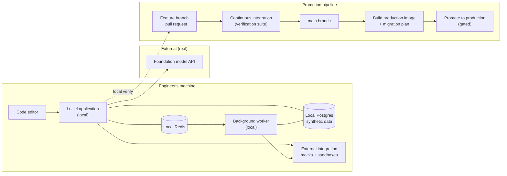
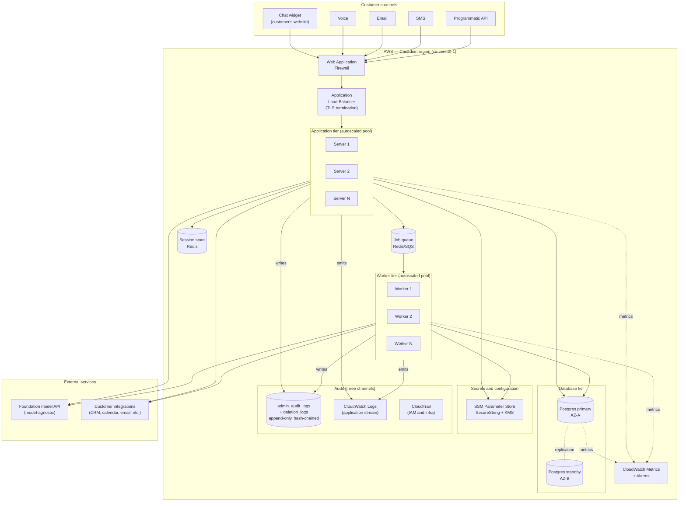
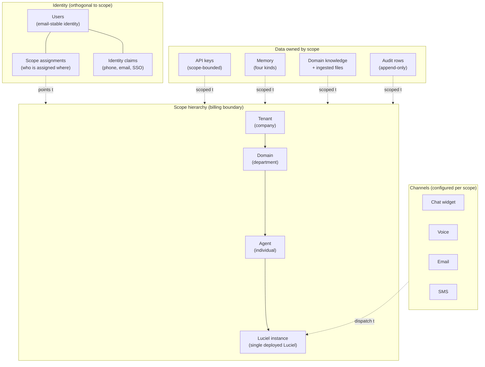

# Luciel — Architecture (Design)

**What this document is:** The design for how Luciel is built — both the development environment where we work, and the production environment where customers use it. Every architectural decision is anchored to a business reason from `CANONICAL_RECAP.md`.

**What this document is not:** A snapshot of what the repository currently contains. The repository is the implementation; this document is the design. Gaps between design and implementation are tracked as tokens in `DRIFTS.md`.

**Implementation markers used below.** Each substantive design claim that has a known implementation status carries one of:
- ✅ Implemented — repo (and prod where applicable) match the design
- 🔧 Partial — some of the design exists; specific gaps tracked as drifts in `DRIFTS.md`
- 📋 Planned — design committed; implementation tracked against a named roadmap step
- 🔬 Decision-gate — design says "we will choose later"; not a drift, an open product decision

Absence of a marker means the claim is design-level (architectural property, rationale) rather than a specific verifiable mechanism.

**Audience:** A senior engineer, a security reviewer, a thoughtful customer doing due diligence, or a future hire who needs to understand what we are building and why.

**Maintenance protocol:** Surgical edits only. When the design changes, update the relevant section in place and log the prior decision in `DRIFTS.md`. When the implementation catches up to a section, mark it implemented (per the marker scheme adopted in `DRIFTS.md` Phase 2).

**Last updated:** 2026-05-11 (new §3.2.2 documents the widget CDN tier and the embed-key public-surface model; old §3.2.2 – §3.2.9 each shift by one; §3.2.1 updated to reflect chat-widget live; §3.2.7 Application log stream bullet renumbered from §3.2.6 and retains its 📋 mark for the widget-chat audit gap)

---

## Section 1 — The two environments

Luciel runs in two environments. They are deliberately different, and the differences are part of the design.

**Development.** Where we build, break, and verify. No real customer data ever enters this environment. External integrations are mocked or replaced with sandboxes. The path from a working change in development to a deployed change in production is short, automatic in the parts that should be automatic, and gated at the points that need human judgment.

**Production.** Where customers use the product. Customer data lives only here. Every request is authenticated, scope-bounded, and audited. The environment is in a single Canadian region for data residency. It is designed to fail safe, recover automatically from common failures, and require a human only when something genuinely unexpected happens.

The rest of this document describes each environment, then the cross-cutting properties that span both.

---

## Section 2 — Development environment

### 2.1 What development is for

Development exists to do three things and only three things:

1. Let an engineer make a change to Luciel and see the effect immediately.
2. Run the verification suite that proves the change did not break any existing guarantee.
3. Produce a build artifact (a container image and a database migration plan) that can be promoted to production through a controlled path.

Development is **not** for testing with real customer data, demonstrating to customers, or running long-lived shared services. Anything that needs real-customer-equivalent conditions belongs in a separate staging environment (not yet built; see `DRIFTS.md` once Phase 2 begins).

### 2.2 The pieces

The development environment is a single engineer's machine plus a small set of services running locally or in tightly scoped sandboxes.

**Application server (local).** The same Luciel application that runs in production, running on the engineer's machine. Connects to a local database, a local task queue, and either a sandbox or a mocked version of every external integration.

**Database (local Postgres).** A local PostgreSQL instance with the same schema as production. Seeded with synthetic data — never with anything derived from a real customer. Migrations run against it on every change so schema drift cannot accumulate silently.

**Task queue (local Redis + worker).** A local Redis instance brokers background jobs to a locally-running worker process. The worker is the same code as the production worker, running with the same configuration shape — the only difference is which database and queue it points at.

**Foundation model access.** Calls to AI providers go to the real API in development, because mocking model behavior produces tests that pass against fiction. Cost and rate limits are handled by environment variables that an engineer can tighten on their own machine.

**External integrations.** Every external integration — calendar, CRM, email, SMS, voice, payments — is replaced in development by either a documented sandbox provided by the vendor (Stripe test mode, for example) or a local mock that records what would have been sent. No development call ever touches a real customer system.

**Secrets.** Development secrets are local-only, not derived from production, and never committed. The mechanism for loading them on an engineer's machine is the same mechanism production uses (a single secrets-loader function that reads from a configured source); only the source differs.

### 2.3 How a change moves from local to production

A change to Luciel passes through five stages, in order. The boundaries between stages are where we make sure the change is safe.

1. **Local change.** Engineer modifies the code. The application server reloads automatically. The engineer verifies the change behaves as intended.
2. **Local verification.** The verification suite runs on the engineer's machine. If it does not pass, the change does not move forward.
3. **Branch and pull request.** The change is pushed to a branch. The pull request is the gate where another engineer (or the founder) reviews it. The verification suite runs again, in continuous integration, against a clean checkout — to catch anything that depended on the engineer's local environment.
4. **Merge to main.** Once the pull request is approved and CI is green, the change merges to the `main` branch. Main is always deployable.
5. **Promotion to production.** A separate, deliberate step (not a merge side-effect) builds the production container image, runs migrations, and rolls the application servers and workers. Promotion is gated on a green production verification run.

The gates exist because the cost of a bad change increases exponentially after each one. A bug caught locally costs ten minutes; a bug caught in CI costs an hour; a bug caught in production after a customer noticed costs a day, a credit, and trust.

### 2.4 Development environment diagram

### 2.5 What development deliberately does not have

These are not gaps; they are decisions.

- **No real customer data.** Ever. Synthetic seeds only.
- **No real external sends.** Calendar invites, emails, SMS, payments — all sandboxed or mocked.
- **No production secrets.** Production secrets are unreachable from a developer machine.
- **No long-lived shared instance.** Each engineer runs their own. A future staging environment will fill the "shared, integration-tested, customer-equivalent" role.
- **No production data migration on local Postgres.** Migrations run forward against synthetic seeds; never copy production schema state down.

---

## Section 3 — Production environment

### 3.1 What production is for

Production exists to do four things:

1. Receive customer requests through any of the supported channels (chat widget, phone, email, SMS, and a programmatic API for integrators).
2. Authenticate every request, resolve which scope it belongs to, and reject anything that crosses a scope boundary.
3. Produce a Luciel response — composed of memory retrieval, tool invocation, foundation-model reasoning, and policy enforcement — and return it on the same channel.
4. Record every consequential action in the audit trail, atomically with the action itself, so the trail cannot diverge from reality.

Production is also responsible for keeping itself running — recovering from worker failures, scaling under load, and rotating secrets — without human intervention for the common cases.

### 3.2 The pieces

The production environment runs in **AWS, Canadian region (`ca-central-1`)**, deliberately. Customer data residency is a real differentiator for Canadian brokerages, and Canadian-region operation is a defensible answer in due diligence.

#### 3.2.1 Public endpoint

Customers reach Luciel through a single public hostname (the production API endpoint). The hostname is fronted by an Application Load Balancer. 📋 The full multi-channel surface lands in roadmap Step 34a; as of 2026-05-10 the chat widget (see §3.2.2 for its CDN tier and embed-key model), the programmatic API, and the operator-facing admin surface are the live channels, while voice / email / SMS adapters are still planned — see `DRIFTS.md` token `D-channels-only-chat-implemented-2026-05-09`.

*Why a load balancer:* it terminates TLS once, distributes incoming requests across multiple application servers (so a single server failure does not take the platform down), and provides a single chokepoint where request rate-limits and a Web Application Firewall can be applied. The chokepoint also gives the operator a single place to flip traffic during a deployment or roll back from one.

*Why not API Gateway:* an ALB is the right tool for steady-state, long-lived, multi-channel traffic with WebSocket and streaming response support. API Gateway is well-suited to bursty, request-response, function-style workloads, which Luciel is not.

#### 3.2.2 Public widget surface (CDN + embed keys)

The chat widget is a public surface: the JavaScript bundle that customers paste into their site is served by a content delivery network, and every chat turn it makes to the production API is authenticated by a key designed for public distribution. Both pieces are distinct from the rest of §3.2 — they sit at the edge alongside §3.2.1, before any request reaches the application tier — and warrant naming.

**Widget bundle CDN.** The widget bundle (`widget.js`, currently ~27 KB) is published to a CloudFront distribution backed by an S3 bucket in the same Canadian region as the rest of production. Two URLs serve the same body: a stable alias (`/widget.js`, `max-age=300, must-revalidate`) for customers who want auto-updates on a five-minute lag, and an immutable hashed alias (`/luciel-chat-widget.<hash>.js`, `max-age=31536000, immutable`) for customers who want to pin a specific version. Both URLs stay reachable forever — the deploy pipeline is forward-only, never overwriting an existing hashed bundle.

*Why CDN, not direct from the application tier:* customers' sites embed the bundle on every page load; serving it from the application tier would put every page-load request on the same path as chat turns and tax the wrong scaling axis. A CDN serves the static bundle at the edge, near the visitor, with no application-tier (§3.2.3) involvement.

*Why a Canadian-region origin:* data residency. The bundle has no PII in it, but the residency story is cleaner when every Luciel-controlled production resource sits in `ca-central-1`. The CDN itself is global, as it must be — a Toronto visitor and a Vancouver visitor should both get fast bundle loads — but the origin is Canadian.

*Pattern E for bundles:* the deploy pipeline is forward-only. A new bundle build produces a new hashed filename; the old hashed filename is never deleted. A customer that pinned `luciel-chat-widget.36a25740a60c.js` two months ago still gets that exact bundle today. The stable alias `widget.js` is updated to point at the new bundle, but the old bundle stays reachable for any pinned consumer. This is the bundle analogue of §4.6 (Pattern E for secrets): deactivation by replacement, never deletion.

**Public-surface keys (embed keys).** Embed keys are a distinct kind of API key from the admin keys operators use to manage tenants and domains. The differences are deliberate:

- An embed key is scoped to a single domain and a small set of allowed origins (exact scheme + host + optional port, no wildcards or paths). A POST from any other origin is refused at the auth layer regardless of what the key permits.
- An embed key carries a `widget_config` (accent color, display name, greeting message) that the widget bundle reads to brand the chat surface per customer. This is the only place where customer-facing presentation is encoded outside the customer's own site.
- An embed key carries a per-key rate limit (today static, designed to be tunable per customer once Step 31 dashboards expose it).
- An embed key has the chat permission and only the chat permission — it cannot call admin endpoints, cannot mint other keys, cannot invoke tools. The three-layer scope enforcement described in §4.7 applies the same way it does to any other key.
- An embed key is **safe to ship in public source code** on the customer's site, because origin enforcement plus permission constraint plus rate limit plus domain scoping bound the worst case to "a malicious actor on an allowed origin can run a chat session at the published rate limit." That is a customer-tolerable failure mode; an admin key in the same position is not.

*Why embed keys exist as a separate kind:* the trust model is different. Admin keys are operator secrets and rotate per operator. Embed keys are customer-shipped credentials and rotate per customer-side incident (e.g., a customer accidentally publishes their key to the wrong repo). Conflating them would either over-protect admin keys with widget concerns or under-protect customer surfaces with admin assumptions.

*Pattern E for embed keys:* deactivation, never deletion. A rotated embed key remains in the `api_keys` table with `is_active=false`; the audit chain (§3.2.7) stays walkable. The customer pastes a new key into their site and the old one stops authenticating on the next request.

*Issuance:* `POST /admin/embed-keys` (with three scope guards and an audit row written in the same transaction as the key insert) or the operator CLI `scripts/mint_embed_key.py`. Both paths funnel through the same `EmbedKeyCreate` schema and the same service entrypoint, so they cannot drift on validation or audit behavior. The raw key value is returned exactly once at mint time and is never recoverable; SSM (§3.2.8) is rejected for embed keys at the service layer because the customer cannot read SSM.

#### 3.2.3 Application tier

A pool of application servers runs the request-handling Luciel code. Each server is identical, stateless across requests, and replaceable. Scaling is horizontal — adding capacity means adding more servers, not making any one server larger.

*Why stateless:* statelessness is what makes recovery and scaling trivial. Any conversation state that needs to persist across requests lives in the database or in a session store, not in server memory. A server can die mid-request and the next request from the same conversation routes to a healthy server with no loss.

*Why a pool, not a single server:* survivability. Single-server architectures fail visibly to the customer when the one server fails. A pool absorbs the failure of any one member.

*Autoscaling:* application-tier capacity scales on observed load (request rate, CPU, response latency). The minimum is sized to absorb a single-server failure without customer impact; the maximum is sized to absorb any plausible burst the GTM plan would produce.

#### 3.2.4 Background worker tier

A separate pool of worker processes handles work that should not block a customer's chat response. Per-responsibility status:
- ✅ Memory extraction (the worker task that reads recent turns and persists durable memories)
- 🔧 Document ingestion — implemented today as foreground code in `app/knowledge/ingestion.py`, not as a worker task; promotion to background is roadmap Step 34
- 📋 Scheduled retention purge — the policy exists in `app/policy/retention.py`; the worker that runs it does not — see `DRIFTS.md` token `D-retention-purge-worker-missing-2026-05-09` (load-bearing because Section 4.4 depends on it)
- 📋 Search-index refresh, follow-up emails, and other workflow-action background work — roadmap Step 34

Workers receive jobs from a queue and report results back through the database.

*Why a separate tier:* a worker doing a 30-second document ingestion should never delay a customer's three-second chat response. Putting workers on their own pool isolates the two workloads from each other.

*Why a queue, not direct invocation:* the queue is what makes worker failures invisible to the customer. If a worker dies mid-job, the queue redelivers the job to another worker. The customer's interaction was already complete when the job was enqueued; the worker is doing its work behind the scenes.

*Production broker:* **Amazon SQS** (not Redis) in production. Redis is the development broker only. The split is documented in detail in `app/worker/celery_app.py` (lines 116-138) and exists because ElastiCache Redis in cluster mode cannot satisfy kombu's MULTI/EXEC requirements (ClusterCrossSlot constraint), and SQS is the right primitive for durable, multi-AZ job delivery in AWS. The architecture diagram in Section 3.6 shows "Job queue Redis/SQS" — read that as Redis-in-dev / SQS-in-prod, not as a choice.

*Worker autoscaling:* worker-tier capacity scales on queue depth and CPU. Quiet hours run a small fixed pool; busy hours scale up to absorb the backlog and scale back down once it clears.

#### 3.2.5 Database — PostgreSQL on Amazon RDS, Canadian region

A single managed PostgreSQL instance (with a hot standby in a second availability zone) holds the durable state of the platform.

*Why Postgres:* mature, audited, and supports the relational integrity our scope hierarchy depends on. Every Luciel, memory, key, and audit row has a foreign key to its scope, and the database enforces it — so a bug in our application code cannot accidentally hand one scope another scope's data, regardless of which scope level (tenant, domain, agent, or instance) is involved.

*Why managed RDS rather than self-hosted:* operational maturity. Backups, point-in-time recovery, version upgrades, and standby failover are all handled by AWS. The cost of self-hosting Postgres at this stage is engineering time we do not have to spare.

*Why a single instance, not a per-tenant instance:* cost and operational simplicity. Per-tenant isolation at the row level (with hard-enforced scope foreign keys) gives us the isolation properties we need without paying for a separate database per customer. The dedicated-infrastructure tier (Section 13 of the canonical recap) provides a per-tenant database for customers whose compliance posture requires it; that is a deliberately separate product.

*Two database roles, not one.* The application server connects as a privileged role that can write any table, including identity tables. Background workers connect as a least-privilege role that can read most tables and write some, but **cannot** write to identity tables, audit tables, or anything that mints or rotates keys. This is enforced at the database grant level, not in application code.

*Why two roles:* a worker bug, or a worker compromise, must not be usable to mint or rotate keys. The database refuses the write, regardless of what the worker code says. Defense in depth.

#### 3.2.6 Memory tier

Memory is layered (per the canonical recap). The four kinds — session, user preference, domain, client operational — live as distinct logical concerns over the database, with retrieval driven by a memory service.

*Session memory* lives in a fast key-value store (Redis) for the active conversation, with a short time-to-live; persistent state for that conversation is also written to Postgres so a Redis flush does not lose conversation history.

*User preference memory*, *domain memory*, and *client operational memory* all live in Postgres, with vector embeddings for semantic retrieval and (per the strategic answer to Q3) an opt-in graph layer for relationship-walking queries — implemented first as recursive Postgres queries, with a path to a dedicated graph database when scale demands it.

*Why layered, not flat:* different kinds of memory have different retention rules, different scoping rules, and different retrieval patterns. Flat memory cannot enforce that user preferences should expire or be exportable on request, while operational rules should not. Layering is what makes the policies enforceable.

#### 3.2.7 Audit trail

Every consequential action in production produces an immutable audit record. There are three independent channels, designed so a tampering attempt is detectable.

- **Database audit log.** A append-only table (`admin_audit_logs`) that records every control-plane and data-plane control event (key minting, scope changes, deactivations, deletions, configuration changes). Each row is hash-chained to its predecessor — modifying any historical row breaks the chain and is detectable on the next verification run.
- **Application log stream.** A separate stream (CloudWatch Logs) where the application emits the same audit events in human-readable form. Independent of the database. Useful for forensic investigation, incident response, and regulator-facing exports. 📋 Implementation incomplete for the customer-facing widget chat surface: as of 2026-05-11, `app/api/v1/chat_widget.py` emits no per-turn structured log line (no `tenant_id`/`domain_id`/`embed_key_prefix`/`session_id` audit record), so this channel currently carries control-plane events but not chat-turn events. Tracked as `D-widget-chat-no-application-level-audit-log-2026-05-10`. Closes with Step 31 (dashboards + validation gate).
- **AWS CloudTrail.** AWS's own immutable record of every IAM and infrastructure action — who logged in, who minted what, what was deployed when. We do not write to CloudTrail; AWS does, and we read it.

A retention purge produces records in a fourth append-only table (`deletion_logs`) so retention events are distinguishable from control-plane events but follow the same immutability discipline.

*Why three channels:* an attacker who compromises the application can write false rows to the database log, but cannot retroactively rewrite the application log stream or CloudTrail. A regulator asking "show me what happened" gets three independent answers; if they disagree, that disagreement is itself the signal.

#### 3.2.8 Secrets store

Every secret used in production — database credentials, foundation-model API keys, third-party integration credentials, signing keys — lives in AWS Systems Manager Parameter Store as a SecureString, encrypted with a customer-managed KMS key.

*Why Parameter Store, not environment variables baked into images:* secrets in container images leak. Image layers are inspectable. A compromised image registry exposes every secret used by every image. Parameter Store decouples secrets from images — the image fetches the secret at startup, and rotating the secret means updating Parameter Store, not rebuilding and redeploying.

*Why SSM, not Secrets Manager:* both work; we picked Parameter Store for cost predictability and because the audit story (CloudTrail records every read) is identical.

*Pattern E:* secrets are deactivated, never deleted. A rotated secret remains in Parameter Store with a deactivated flag, so an audit query can reconstruct what credential was active at any past moment. This is part of the broader audit-chain discipline (see Section 4). 🔬 The exact SSM-side mechanism for the deactivated flag (suffix-renamed parameter vs. SSM version history) is pending operator confirmation — see `DRIFTS.md` token `D-prod-secrets-pattern-e-unverified-2026-05-09`.

#### 3.2.9 What integrations exist today

The design anticipates a full slate of external integrations — calendar, CRM, email, SMS, voice, payments — with a sandbox-in-development / real-in-production split per integration. Today, the integrations layer (`app/integrations/`) contains only the foundation-model clients (Anthropic and OpenAI). The tool registry shape (`app/tools/registry.py`, `app/tools/broker.py`) is in place; the integrations themselves are not. 📋 The full slate is roadmap Step 34 (Workflow actions); the channel surface specifically is roadmap Step 34a. Tracked as `DRIFTS.md` token `D-external-integrations-llm-only-2026-05-09`.

This subsection exists so the doc stops implying the full slate is present. The framework is ready; the integrations are not.

#### 3.2.10 Monitoring and alerting

Production emits four kinds of signal:

- **Metrics:** request rate, error rate, latency percentiles, worker queue depth, database connection saturation, foundation-model token usage. CloudWatch Metrics.
- **Logs:** the application log stream described above, plus access logs from the load balancer.
- **Traces:** for slow or failed requests, a trace records which database calls, model calls, and tool calls were made and how long each took. Used for debugging slow conversations.
- **Alarms:** thresholds on metrics that, when crossed, page the operator. Examples: error rate above 1% sustained for five minutes, queue depth above 1000 for ten minutes, database connection saturation above 80%.

*Why all four:* metrics tell us *that* something is wrong; logs and traces tell us *what* is wrong; alarms tell us *when* to act. Removing any of the four leaves a gap.

### 3.3 How a customer request flows through production

A customer sends a message to a Luciel through any supported channel. Here is what happens.

1. **Channel ingest.** The message arrives at the appropriate channel adapter. 📋 Today only the chat widget and programmatic API adapters exist; voice / email / SMS adapters are roadmap Step 34a. The adapter normalizes the message into the same internal format regardless of channel.
2. **Public endpoint.** The normalized request lands at the production API endpoint, fronted by the load balancer. The load balancer terminates TLS and forwards the request to a healthy application server.
3. **Authentication.** The request includes a key (or a session token derived from a key). The application server resolves the key to its owning scope (tenant, domain, agent, or specific Luciel instance). Unknown keys are rejected with a 401.
4. **Scope policy check.** The server confirms the key has authority over the resource being accessed. A request to access a resource that lives outside the requesting key's scope is rejected with a 403, even if the key is otherwise valid. The rejection holds whether the boundary being crossed is between two tenants, two domains within a tenant, two agents within a domain, or two Luciel instances under the same agent. Scope is enforced at the server, and again at the database (foreign-key constraint), and again at the database role grant. Three layers.
5. **Memory retrieval.** The server asks the memory service for context relevant to this conversation: session memory for the active conversation, user preferences if the customer is identified, domain memory for the vertical, client operational memory for the deploying organization. Retrieval is scoped — a Luciel cannot pull memory from a sibling Luciel's scope.
6. **Reasoning.** The server assembles the persona prompt (Soul layer), the profession prompt (Profession layer), the retrieved memory, and the user's message into a foundation-model call. The model produces a response and, if needed, a tool-invocation plan.
7. **Tool invocation.** If the response calls for an action (book an appointment, send an email, query a CRM), the server invokes the relevant tool through the tool registry. Every tool invocation goes through the same scope policy check as the original request — a tool cannot reach outside the scope of the calling Luciel.
8. **Action classification.** Each tool invocation is classified into one of three tiers, and the tier determines what happens next:
   - **Routine** — just do it. The action executes immediately and an audit row is written. Examples: logging a call note Luciel was clearly authorized to log; pulling a customer's calendar to read availability; saving a memory.
   - **Notify-and-proceed** — execute and surface visibly to the customer. The action runs without blocking, and the response shows the customer what was done, so they can intervene if needed. Examples: sending a routine follow-up email; creating a CRM lead; booking a meeting on a slot the customer already offered.
   - **Approval-required** — return a confirmation request to the customer rather than executing. The action runs only after explicit approval. This tier is reserved for actions that are genuinely consequential: irreversible (sending a contract, charging a card, deleting data), high-blast-radius (mass communications, anything affecting other people on the customer's behalf), off-pattern relative to the customer's established usage (a $10,000 spend when the pattern is $200, an action in a category they have never done), or where Luciel itself is uncertain.

   The senior-advisor voice committed in Recap Section 3 depends on this tiering being right: a senior advisor does not interrupt to ask permission for routine work, but does pause when the stakes warrant it. 📋 The classifier and the gate land together in roadmap Step 30c (Action classification); today none of the three tiers exist — see `DRIFTS.md` token `D-confirmation-gate-not-enforced-2026-05-09`.
9. **Audit emission.** Every consequential action — key resolution, scope check, tool invocation, policy gate, configuration change — produces an audit row, written atomically with the action it describes.
10. **Response.** The final response is returned through the same channel adapter that received the message, formatted appropriately for that channel (text for chat, voice synthesis for phone, etc.).
11. **Background work.** Anything that does not need to block the response — embedding the new message into memory, refreshing a search index, sending an external email — is enqueued for background workers.

### 3.4 What guarantees the production environment provides

These are the architectural commitments. Every commitment is enforced by a specific mechanism, not by good intentions.

| Guarantee | How it is enforced |
|---|---|
| Customer data lives only in Canada | All data services and storage are in `ca-central-1` |
| Scopes cannot access each other's data — at any level (tenant, domain, agent, or instance) | Foreign-key scope on every scope-bearing table; server-side scope policy check; least-privilege database role for workers |
| Workers cannot mint or rotate keys | Database grants on the `luciel_worker` role exclude write access to identity and audit tables |
| Every consequential action is audited | Three-channel audit (database, application log stream, CloudTrail), all append-only, hash-chained where applicable |
| A single-server failure is invisible to the customer | Application tier and worker tier both run as pools; load balancer routes around failures |
| A single-availability-zone failure is recoverable | Database has hot standby in a second availability zone; application and worker tiers run across multiple availability zones |
| Secrets cannot be inspected from container images | All secrets in Parameter Store SecureString, encrypted with customer-managed KMS key, fetched at runtime |
| A retention purge cannot break the audit chain | Purges write to `deletion_logs` (append-only) and run under `FOR UPDATE SKIP LOCKED` so they do not block live traffic |
| A bad deploy can be rolled back without data loss | The application is stateless; rollback is replacing the running image with the previous one. Migrations are forward-compatible by design — a new image that adds a column does not break the previous image |
| A scope's deactivation is atomic | Deactivating a scope flips `active=false` on the scope row and cascades through every dependent resource in a single transaction. The same mechanism handles a tenant cancelling their subscription, a domain being wound down, or an agent leaving an organization |

Production-tier verification of the items in this table that depend on AWS configuration (Multi-AZ standby, autoscaling, alarms, KMS key management) is tracked as `[PROD-PHASE-2B]` drifts in `DRIFTS.md`.

### 3.5 What a failure looks like and how it recovers

The interesting cases are the ones the platform handles without a human.

**Application server crash.** The load balancer health-check detects the dead server within seconds and routes traffic away from it. Autoscaling launches a replacement. The customer experiences either a single retried request (if their request was in flight) or no impact at all.

**Worker crash.** The job the worker was processing is redelivered to another worker by the queue. Idempotency on the job ensures the work is not done twice; if it was already partially complete, the second attempt picks up cleanly.

**Database primary failure.** RDS automatically fails over to the standby in a second availability zone. The application tier reconnects on the next request. Customer impact is a brief (seconds) period of failed requests, which the application surfaces as a retry-after rather than an error.

**Foundation model provider outage.** The reasoning step fails. The application returns a graceful fallback ("I'm having trouble reaching the model — please try again in a moment") and emits an alarm. If the outage persists, the operator can switch to a backup provider through configuration, because Luciel is model-agnostic by design.

**Cascading load.** Autoscaling on both application and worker tiers absorbs the load up to their configured maximums. If the maximums are hit, the load balancer rate-limits new requests and returns a 429 — preserving service for customers already in conversation. Alarms fire to wake the operator; the operator can raise the maximums temporarily and investigate root cause.

**Configuration error in a deploy.** The pre-deploy verification suite catches most configuration errors before they reach production. The ones that slip through manifest as elevated error rate post-deploy; the deploy is rolled back to the previous image while the error is investigated.

**A genuine bug.** The bug is logged, traced, and (depending on severity) either rolled back or hotfixed forward. Drift token in `DRIFTS.md`. Post-incident review.

### 3.6 Production architecture diagram

*Diagram caveats:* Voice, email, and SMS channel adapters in the diagram are 📋 (Step 34a). The job queue is shown as Redis/SQS to span both environments — read it as **SQS in production, Redis in development**. WAF presence in production is `[PROD-PHASE-2B]`-pending operator verification.

---

## Section 4 — Cross-cutting architectural properties

These are properties of the system that span both environments and are not visible in any single piece. Each is a design commitment, anchored to a business reason from the canonical recap.

### 4.1 Scope hierarchy as the billing boundary

The scope hierarchy — `tenant → domain → agent → Luciel instance` — is the single organizing principle of the data model. Every Luciel, every memory record, every key, every audit row has a foreign key to its scope. Scope is enforced at three layers (the application server, the database foreign-key constraint, and the database role grants).

*Why:* the canonical recap commits that pricing tiers map 1:1 to scope levels. If scope is leaky — if an agent-scope key can read another agent's memory — then the Individual tier delivers Team-tier value at Individual-tier price. The architecture's job is to make scope leakage impossible at the data layer, not at the application layer alone.

A separate, orthogonal table set (`users`, `scope_assignments`) records who is currently assigned to which scope. People come and go; scope persists. When a person leaves, their assignments are revoked but the scope's data remains owned by the scope.

### 4.2 Soul layer and Profession layer at runtime

Luciel's two-layer design (Section 2 of the canonical recap) is reflected in how a request is composed.

The **Soul layer** is loaded from a versioned, immutable persona configuration shared across every deployment. Changing the Soul layer is a deliberate platform-wide event. A customer cannot modify the Soul layer, and a brokerage's configuration cannot override it — this is what enforces the behavior contracts in Section 4 of the canonical recap (e.g., Luciel cannot be configured to coerce, even by a paying customer).

The **Profession layer** is loaded per scope: the deploying organization's domain knowledge, tools, workflows, and configuration. This is what makes a real-estate Luciel feel like a real-estate Luciel.

At runtime, both layers are composed in a single foundation-model context, with the Soul layer placed structurally so it cannot be overridden by injected Profession-layer content. This is enforced both by the prompt structure and by output-side policy checks that catch a model trying to violate Soul-layer rules even if the prompt was somehow compromised. 🔧 Today, prompt assembly happens in `app/services/chat_service.py` rather than being consolidated in `app/runtime/context_assembler.py`, and the output-side policy guard does not yet exist — tracked as `DRIFTS.md` token `D-context-assembler-thin-2026-05-09`.

### 4.3 Immutable audit chain

Every audit-bearing table in the database is append-only and hash-chained. New rows include a hash of the previous row's content; modifying a historical row breaks the chain on the next verification run.

*Why:* a regulator or a brokerage's compliance officer asking "show me what happened, and prove no one tampered with the record" gets a defensible answer. The application code cannot lie about history, because the chain is verifiable independent of the application.

Three append-only logs matter most:

- `admin_audit_logs` — control-plane and data-plane control events; hash-chained at the row level
- `deletion_logs` — retention purge events; append-only
- `scope_assignments` — every change in who is assigned to what scope is recorded as a new row, never an `UPDATE` in place. The same table acts as both the current-state view (latest active row per (user, scope)) and the immutable history. This **append-on-change discipline** is enforced in the repository layer rather than by a separate `*_history` table, because a single append-only table is simpler and removes the consistency risk of keeping current-state and history in sync

A regulator-facing export merges all three streams ordered by timestamp, with bulk events expanded on demand.

### 4.4 Soft-delete by default

Every "delete" operation in production flips an `active=false` flag rather than removing the row. Hard purges happen only through the scheduled retention worker, after the contracted retention period.

*Why:* two reasons.

1. **Audit chains stay intact.** A regulator's question "what was deleted, by whom, and when?" gets a real answer.
2. **Accidental deletes are recoverable.** A misclick by any scope admin — tenant, domain, or agent — is not a permanent data loss event during the retention window.

The cost is that storage grows. The retention worker handles that, in batches sized to coexist with live traffic without lock contention. 📋 The retention worker itself does not yet exist; the policy in `app/policy/retention.py` is enforced today only when triggered by application code paths, not by a scheduled worker. Tracked as `DRIFTS.md` token `D-retention-purge-worker-missing-2026-05-09` — load-bearing for this section's storage-cost story.

### 4.5 Cascade-correct departure

When a scope is deactivated, the cascade flips `active=false` atomically across every dependent resource at and below it. Deactivating a tenant cascades through its domains, agents, Luciel instances, memory records, keys, and scope assignments. Deactivating a domain cascades through its agents, instances, and memory. Deactivating an agent cascades through their instances and memory. The cascade runs in a single transaction at every level. Partial cascades are not possible.

*Why:* the canonical recap (Section 13.2 T11) commits that a customer's offboarding is a clean, atomic event. If the cascade left half the customer's resources active, the brokerage's compliance officer cannot in good conscience tell their board "we exited cleanly." Atomicity is the architectural guarantee that makes the customer-facing commitment defensible — and the same guarantee applies whether the offboarding is a whole tenant cancelling, a domain being wound down, or an individual agent leaving.

### 4.6 Pattern E for secrets

Every secret in production is created, rotated, and deactivated — never deleted. Rotated secrets remain in the secrets store with a deactivated flag and a timestamp.

*Why:* an audit query needs to be able to reconstruct "what credential was active at this moment in the past?" Hard-deleting a rotated secret destroys that ability. Pattern E preserves it.

### 4.7 Three-layer scope enforcement

A request that asks for cross-scope data must be rejected, and we want that rejection to hold even if one of our defenses fails. So scope is enforced at three independent layers:

1. **Application layer.** The server resolves the requesting key's scope and refuses to dispatch the request if it crosses a boundary.
2. **Database foreign-key layer.** Every scope-bearing row's scope foreign keys are non-null and non-changeable. A bug in the application that asks for a row by ID still cannot return a cross-scope row, because the lookup includes a scope predicate that the database refuses to relax.
3. **Database grant layer.** The least-privilege role used by workers cannot write to identity or audit tables. A worker bug or compromise cannot mint or rotate a key, regardless of what its code says.

This is defense in depth. Each layer alone is sufficient most of the time; together they make a single bug in any one layer not enough to breach.

### 4.8 Foundation-model agnosticism

Luciel calls foundation models through a model-agnostic interface. Switching from one provider to another is a configuration change, not a rewrite.

*Why:* two reasons.

1. **Provider risk.** A foundation-model provider can have an outage, change its pricing, deprecate a model we depend on, or be unavailable in our region. The architecture must let us route around any single provider.
2. **Model fitness for purpose.** Different domains and different cognitive abilities (Section 7 of the canonical recap) may be better served by different models. An evaluation framework (roadmap Step 33) is what tells us which model fits which job; agnosticism is what lets us act on the evaluation.

### 4.9 Design choices we deliberately did not make

These are alternatives we considered and rejected. Recording them here prevents them from being rediscovered as "new ideas."

- **Per-tenant database (instead of row-level scope).** Considered and rejected at this stage because cost and operational overhead grow linearly with customer count, while row-level scope with three-layer enforcement provides the isolation properties we need. The dedicated-infrastructure tier (Section 13 of the canonical recap) is the deliberate exception, built on demand for customers whose compliance posture requires it.
- **Single application + worker process (instead of two pools).** Rejected because it couples customer-facing latency to background work duration. A 30-second document ingestion would block a 3-second chat response.
- **State stored on application servers (instead of stateless servers + database/session store).** Rejected because it makes survivability and scaling far harder.
- **Synchronous tool invocation only (instead of tiered action classification).** Rejected because the canonical recap (Section 4) commits that Luciel does not take consequential action without permission. Synchronous-only invocation cannot honour that contract. The chosen design is the three-tier classifier (routine / notify-and-proceed / approval-required) described in Section 3.3 step 8 — it preserves the senior-advisor voice (no nuisance approvals on routine work) while preserving the contract (genuine approval gate when an action is consequential).
- **Hard-delete on cancel (instead of soft-delete + scheduled purge).** Rejected because it breaks audit chains and makes accidental deletes irreversible. Soft-delete + retention is the design.
- **Single audit channel (instead of three independent channels).** Rejected because a single channel can be tampered with by anyone who can compromise it. Three channels make tampering detectable.

---

## Section 5 — Conceptual model: scope, identity, and data flow

A diagram of how the pieces relate conceptually, separate from the deployment topology. Useful when reasoning about why a particular data layout is the way it is.

The two important things this diagram shows:

1. **Identity (people) is orthogonal to scope (data).** Sarah is a `User`. Sarah's `scope_assignments` say which scopes she has authority over. The data she works with belongs to the scope, not to her. When Sarah's role changes, her assignments change; the data does not.
2. **Channels are dispatched per scope.** A single Luciel instance can be reachable through multiple channels. Adding a channel is a configuration change on the instance, not a separate product.

---

## Section 6 — Maintenance protocol

- This document is the design. It does not describe what the repository currently contains.
- Surgical edits only. When a design decision changes, update the relevant section in place and log the prior decision in `DRIFTS.md`.
- When the repository catches up to a section, an implementation marker is added to that section (per the marker scheme adopted in `DRIFTS.md` Phase 2).
- No version-history sediment. The document reflects the current design.
- One source of truth per fact. If a fact appears in two sections, delete one.
- The diagrams are part of the design, not decoration. When a diagram disagrees with the prose, both are wrong until they agree.

---

## Section 7 — Source-of-truth rule

If a chat summary, a session recap, a slide, or any other artifact contradicts this document, **this document wins**. Update the document; do not produce contradicting versions in flight.
